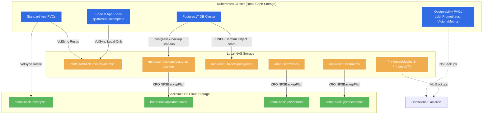

# Cluster & NAS Backup Strategy

This document outlines the backup architecture for the home-cluster and
connected Network-Attached Storage (NAS) shares. The system is designed around
the **3-2-1 backup strategy** with conscious exceptions for large,
non-critical, or media datasets.

---

## High-Level Architecture Diagram



---

## 1. The 3-2-1 Backup Strategy

The core strategy for critical data adheres to the 3-2-1 backup model:

1. **3 Copies of Data**: 1 Production copy + 2 Backup copies.
2. **2 Different Media**: 2 different storage systems (e.g., Ceph block storage, local NFS NAS, and cloud object storage).
3. **1 Offsite Location**: At least 1 copy stored in a remote cloud provider (Backblaze B2).

---

## 2. Workload-Specific Policies

### Standard Application PVCs (3-2-1 Plan)

Most applications deployed in the Kubernetes cluster (e.g., `vaultwarden`, `home-assistant`, `paperless`, `forgejo`, etc.) use the standard VolSync `primary` template (located in [cluster/templates/volsync/primary](../cluster/templates/volsync/primary)).

- **Copy 1 (Production):** Rook-Ceph PVC (`ceph-block` or `ceph-fs`).
- **Copy 2 (Local Backup):** Replicated to the local NAS via VolSync's NFS replication (`${APP}-nfs` ReplicationSource). Schedules are staggered to prevent resource contention.
- **Copy 3 (Offsite Backup):** Replicated to Backblaze B2 via VolSync's B2 replication (`${APP}-b2` ReplicationSource).

---

### Database Clusters (3-2-1 Plan split by type)

Database backup flows are separated into local physical recovery paths (for quick, up-to-the-minute restores) and offsite disaster recovery paths (for total rebuilds) to optimize speed, reliability, and transaction costs.

#### A. CloudNativePG (CNPG) Postgres17

- **Copy 1 (Production):** Postgres PVCs in the cluster.
- **Copy 2 (Local Physical & WAL Backup - for Quick / Up-to-the-Minute Restores):**
  CNPG writes physical base backups and continuous Write-Ahead Log (WAL)
  archives using Barman natively to a local MinIO bucket (`s3://postgresql/`).
  The MinIO server persists these blocks directly to the local NAS NFS share
  `/mnt/user/Objects/postgresql`. This enables near-instantaneous point-in-time
  recovery (PITR) down to the exact second.
- **Copy 2 (Local Logical Backup):** A daily Kubernetes CronJob (`postgres17-backup`)
  connects to `postgres17-ro`, dumps all database schemas into logical SQL files
  (`.sql.gz`), and stores them in `/mnt/user/backups/postgres-backup`.
- **Copy 3 (Offsite Logical Backup - for Disaster Recovery):** The KRO
  `NFSBackupPlan` job (`databases`) runs daily at 4:30 AM, backing up the logical
  dumps from `/mnt/user/backups/postgres-backup` to Backblaze B2.
  > [!TIP]
  > Restricting the B2 sync to logical SQL dumps instead of the physical WAL
  > directory saves significant transaction fees in B2, as we avoid uploading
  > thousands of tiny WAL files. In a disaster recovery scenario, these logical
  > dumps can be easily restored to a fresh PostgreSQL instance.

#### B. Other Databases (MariaDB, CouchDB)

- MariaDB and CouchDB follow the standard **Application PVC** flow, using VolSync templates to perform volume-level restic backups directly to both the NAS and B2.

---

## 3. Policy Exceptions

### Local-Only Backups (2-Copy Plan)

The following workloads are backed up only to the local NAS:

- **`qbittorrent-incomplete-pvc`**: Contains transient/incomplete download states. It uses the VolSync `local-only` component, which skips cloud replication to avoid wasting bandwidth and storage.

---

### NAS Share Offsite Replication (2-Copy Plan)

Certain files live directly on the NAS and do not exist inside the Kubernetes cluster. Their replication is handled via custom `NFSBackupPlan` CRs managed by the KRO operator:

- **Pictures & Documents**:
  - **Copy 1 (Production):** Local NAS directories `/mnt/user/Photos` and `/mnt/user/Documents`.
  - **Copy 2 (Offsite Backup):** Synchronized to B2 daily via `NFSBackupPlans` (`photos` and `documents`).
  - _No third copy exists for these shares._

---

### No Backups (1-Copy Plan / Excluded)

The following datasets are consciously excluded from all backup routines:

- **Media shares (`Movies` and `TV` on the NAS):** The datasets are too large to justify storage costs and can be re-acquired.
- **Observability Datastores (Loki logs, Prometheus db, VictoriaMetrics single):** Data is considered transient and non-critical.

---

## 4. Restore & Recovery Plan

### A. Restoring Standard Application PVCs (VolSync)

If an application's PVC data is corrupted or deleted, you can restore it from either the local NAS or Backblaze B2 using VolSync. There are three primary recovery flows depending on the scenario:

#### 1. Automated Restore via Taskfile (Recommended)

The repository provides helper tasks in [.taskfiles/volsync/taskfile.yaml](../.taskfiles/volsync/taskfile.yaml) to automate the restoration process:

- **List available snapshots:**

  ```sh
  task volsync:list app=<app-name> dest=<nfs|b2> [ns=<namespace>]
  ```

- **Run automated restore:**

  ```sh
  task volsync:restore app=<app-name> dest=<nfs|b2> [ns=<namespace>]
  ```

  _Note:_ The `volsync:restore` command automatically handles suspending Flux sync,
  scaling the application controller down, wiping the target PVC to prevent merge
  issues, deploying the `ReplicationDestination` CR to pull data, waiting for
  the job to complete, and resuming Flux.

#### 2. Automatic PVC Restoration (Delete-and-Reconcile)

Because VolSync templates are integrated directly into the cluster's GitOps manifests:

1. **Delete the target PVC:**

   ```sh
   kubectl delete pvc <pvc-name> -n <namespace>
   ```

2. **Reconcile the Kustomization** using Flux:

   ```sh
   flux reconcile kustomization <kustomization-name> -n flux-system
   ```

3. When the PVC is recreated, the VolSync initialization template detects its absence and automatically triggers a restoration job to recover the latest backup snapshot.

#### 3. Manual Step-by-Step Restore

If you need to perform a manual step-by-step restoration:

1. **Scale down** the target application deployment:

   ```sh
   kubectl scale deployment <app-name> --replicas=0
   ```

2. **Deploy a ReplicationDestination** manifest targeting the corresponding restic repository (either NFS or B2). If restoring from B2, ensure the B2 secret keys are available.

3. **Wait for synchronization** to complete (check the status of the `ReplicationDestination` resource):

   ```sh
   kubectl get replicationdestination -n <namespace>
   ```

4. **Scale up** the deployment back to its original replica count:

   ```sh
   kubectl scale deployment <app-name> --replicas=1
   ```

---

### B. Cluster-Wide State Recovery from NAS

In the event of a total cluster disaster (e.g., losing all nodes), you can restore the entire cluster's application states using only the Git repository and the local NAS backups:

1. **Rebuild the nodes** (e.g. flash Talos OS) and bootstrap the cluster.

2. **Bootstrap Flux GitOps** to pull the configuration from the repository.

3. As Flux reconciles the applications, it will declare all required PVCs.

4. Because the new cluster has empty PVCs, VolSync's initialization templates will automatically intercept the creation of each PVC and populate them by pulling the latest snapshots directly from the local NAS repositories.

5. All applications will bootstrap back to their exact state at the time of the last backup with zero manual copy operations needed.

---

### C. Restoring Postgres Databases (CNPG)

Depending on the failure scenario, use one of the two restore paths:

#### 1. Local Recovery (Quick / Up-to-the-Minute)

If a database instance crashes but the local NAS is intact:

- Bootstrapping a new cluster from the MinIO/NFS barman backups enables point-in-time recovery (PITR) up to the minute of failure.

- Set the `bootstrap.recovery` section in `cluster17.yaml` to point to the local recovery source:

  ```yaml
  bootstrap:
    recovery:
      source: postgres-recovery-source
  externalClusters:
    - name: postgres-recovery-source
      barmanObjectStore:
        destinationPath: s3://postgresql/
        endpointURL: https://cdn.${SECRET_DOMAIN}
        serverName: postgres-17
        s3Credentials:
          accessKeyId:
            name: postgres-minio
            key: MINIO_ACCESS_KEY
          secretAccessKey:
            name: postgres-minio
            key: MINIO_SECRET_KEY
          wal:
            maxParallel: 8
  ```

#### 2. Disaster Recovery (Cloud/B2)

If the cluster and the local NAS are completely destroyed:

1. Provision a fresh Kubernetes cluster and deploy the PostgreSQL operator.

2. Retrieve the logical `.sql.gz` dump files for the required databases from the Backblaze B2 bucket (`home-backups/databases`).

3. Deploy a new database cluster manifest.

4. Extract and pipe the logical backup into the new databases:

   ```sh
   gunzip -c <database_name>-backup.sql.gz | psql -U postgres -h <host> -d <database_name>
   ```
