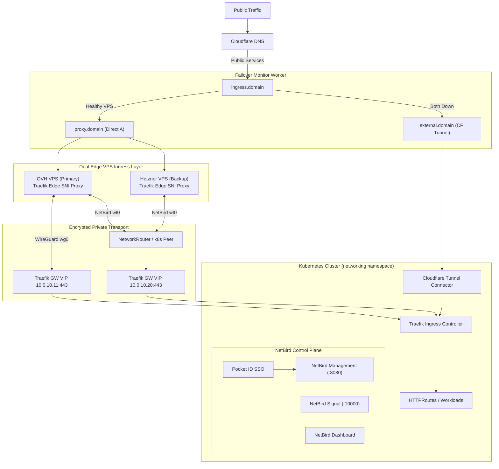
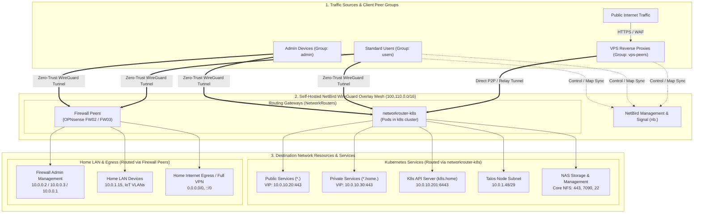

# Edge Ingress & NetBird Mesh Architecture & Operations Guide

This document provides an operational, architectural, and troubleshooting guide
for the **Edge Ingress VPS Nodes**, **Self-Hosted NetBird Mesh & Control Plane**,
and **Dynamic Cloudflare Failover** infrastructure in `home-cluster`.

---

## 1. Overview & Architectural Vision

The cluster ingress infrastructure provides highly available, secure, and
performant public and private ingress without requiring public port forwarding
at the home gateway.



---

## 2. Multi-Tier Failover Hierarchy

Traffic routing follows a strict, zero-downtime failover model:

| Tier                  | Path                                              | Description                                                                      | DNS              |
| :-------------------- | :------------------------------------------------ | :------------------------------------------------------------------------------- | :--------------- |
| **Tier 1 (Edge VPS)** | `ingress.domain` ➔ `proxy.domain` ➔ OVH & Hetzner | Requests hit edge VPS nodes; Traefik forwards TLS over WireGuard / NetBird mesh. | `proxied: false` |
| **Tier 2 (Fallback)** | `ingress.domain` ➔ `external.domain` (CF Tunnel)  | If both VPS nodes fail probes, Worker switches `ingress.domain` to Tunnel.       | `proxied: true`  |

### 2.1 Cloudflare Failover Monitor Worker (`failover-monitor.js`)

Deployed declaratively via OpenTofu (`cloudflare_workers_script.failover_monitor`)
and triggered every minute (`cloudflare_workers_cron_trigger.failover_cron`):

1. **Active Probing**:
   - Probes `https://vps-us.${SECRET_DOMAIN}` (OVH US).
   - Probes `https://vps-eu.${SECRET_DOMAIN}` (Hetzner EU).
   - _Why direct hostnames are probed_: Probing `proxy.${SECRET_DOMAIN}` directly
     would round-robin across both VPS nodes and mask single-node outages.
     Probing direct unproxied hostnames isolates individual node health.
2. **Decision Engine**:
   - If either VPS is healthy (`status < 500`): sets `ingress.${SECRET_DOMAIN}`
     CNAME to `proxy.${SECRET_DOMAIN}` (`proxied: false`).
   - If both VPS nodes are unhealthy: patches `ingress.${SECRET_DOMAIN}`
     CNAME to `external.${SECRET_DOMAIN}` (`proxied: true`).
3. **Alerting**:
   - On state transitions, sends an SMTP notification via Mailgun to
     `postmaster@${SECRET_DOMAIN}` containing attempt latency and HTTP diagnostics.

---

## 3. Kubernetes Gateway API & DNS Architecture

All external traffic enters the cluster via `Gateway/external-gateway` in the
`networking` namespace.

### 3.1 Gateway Configuration (`gateway.yaml`)

```yaml
apiVersion: gateway.networking.k8s.io/v1
kind: Gateway
metadata:
  name: external-gateway
  namespace: networking
  labels:
    gateway.home-operations.io/type: external
  annotations:
    external-dns.kubernetes.io/target: "ingress.${SECRET_DOMAIN}"
    gatus.io/endpoint: |
      group: external
      client:
        dns-resolver: "udp://1.1.1.1:53"
spec:
  gatewayClassName: traefik-external
  addresses:
    - type: IPAddress
      value: "10.0.10.20"
```

- **Unified Gateway**: Consolidates standard and high-bandwidth services (`plex`,
  `photos`, `backups`, `docs`, `sp`, `id`, `nb`, etc.) under a single Gateway.
- **Dynamic Ingress Resolution**: `external-dns.kubernetes.io/target: "ingress.${SECRET_DOMAIN}"`
  instructs `external-dns` to publish all attached `HTTPRoute` hostnames as
  unproxied CNAME records pointing to `ingress.${SECRET_DOMAIN}`.
- **Decoupled Architecture**: `external-dns` manages service CNAMEs (`service ➔ ingress`);
  the Cloudflare Worker exclusively manages `ingress ➔ proxy / external`. There
  is zero DNS thrashing or competition.
- **Label Filter Parity**: Uses `gateway.home-operations.io/type: external`
  (masking domain names in CR metadata).

### 3.2 Dual-VIP Binding (`traefik-external`)

Traefik External Service is allocated two distinct VIPs via Cilium BGP
(`io.cilium/lb-ipam-ips: "10.0.10.20,10.0.10.11"`):

- `10.0.10.11`: Direct WireGuard uplink interface for primary VPS edge transport.
- `10.0.10.20`: Primary external ingress VIP reachable across the NetBird mesh
  and LAN.

---

## 4. Self-Hosted NetBird Architecture (`nb.${SECRET_DOMAIN}`)

The NetBird control plane runs natively inside the cluster backed by CloudNativePG.

### 4.1 Subnet Allocation & CGNAT Compliance

- **Self-Hosted NetBird Subnet**: **`100.110.0.0/16`** (resides in RFC 6598
  Carrier-Grade NAT block `100.64.0.0/10`).
- **Cloud NetBird Subnet (Fallback)**: `100.100.0.0/16`.
- **LAN / Services**: `10.0.0.0/16`.

### 4.2 End-to-End Traffic Routing & Group Model



### 4.3 Access Control & Routing Policy Matrix

| Source          | Target / Destination                    | Ports                 | Gateway                       | Policy                               | Description                                                     |
| :-------------- | :-------------------------------------- | :-------------------- | :---------------------------- | :----------------------------------- | :-------------------------------------------------------------- |
| **`vps-peers`** | `*.${SECRET_DOMAIN}`, `10.0.10.20`      | `80, 443, 8000, 8443` | `networkrouter-k8s`           | `Public Sites`, `External Ingress`   | Reverse-proxying public web apps without exposing ports on LAN. |
| **`users`**     | `*.${SECRET_DOMAIN}`, `10.0.10.20`      | `443`                 | `networkrouter-k8s`           | `Public Sites Policy`                | Authenticated access to public apps.                            |
| **`users`**     | `*.home.${SECRET_DOMAIN}`, `10.0.10.30` | `443`                 | `networkrouter-k8s`           | `Private Sites`, `Internal Ingress`  | Internal home apps (Home Assistant, Grafana, Plex, etc.).       |
| **`users`**     | Gateway `10.0.0.1`, Backup `10.0.1.1`   | Any                   | `firewall02/03`               | `firewall-active`, `firewall-backup` | Core DNS and gateway routing.                                   |
| **`admin`**     | `k8s.home` (`10.0.10.201`)              | `6443`                | `networkrouter-k8s`           | `K8s API Policy`                     | Direct kubectl / k8s cluster administration.                    |
| **`admin`**     | Talos Subnet (`10.0.1.48/29`)           | Any                   | `networkrouter-k8s`           | `k8s nodes Policy`                   | `talosctl` node management and diagnostics.                     |
| **`admin`**     | NAS Storage (`${CORE_NFS_SERVER}`)      | `22, 443, 7090`       | `networkrouter-k8s`           | `NAS Policy`, `Git Access`           | Storage admin, NFS shares, and Git SSH repositories.            |
| **`admin`**     | Firewalls (`10.0.0.2`, `10.0.0.3`)      | Any                   | `firewall02/03`               | `firewall02`, `firewall03`           | OPNsense firewall administrative web GUIs and SSH.              |
| **`admin`**     | Internet Egress (`0.0.0.0/0`)           | Any                   | `firewall02/03` / `vps-peers` | `home-internet-access`, `VPS VPN`    | Full tunnel egress through home or VPS exit nodes.              |

### 4.4 Declarative NetworkRouter & Ephemeral Lifecycle Invariants

1. **Ephemeral Peer Lifecycle (`preStop` Hook)**:
   - `networkrouter-k8s` pods are deployed as ephemeral routing peers
     (`ephemeral: true`).
   - Pods define a `lifecycle.preStop: exec: command: ["netbird", "down"]` hook.
   - When Kubernetes drains a node or rolls pods during updates, kubelet runs
     `netbird down` _before_ the pod network namespace is torn down.
   - This explicitly notifies the NetBird Management server of the disconnect,
     marking the peer as offline (`peer_status_connected = false`) so NetBird's
     background ephemeral cleaner immediately purges it.
2. **Resource Groups vs Routing Routers**:
   - `NBResource` (e.g. `public-services`, `internal-ingress`) binds cluster
     addresses/domains to target **Resource Groups** (`routing-peers`).
   - `NetworkRouter/k8s` acts as the router for the entire `networkID`. NetBird
     automatically routes any traffic destined for `NBResource`s in that network
     through the active router pods without requiring the router pods themselves
     to be in `routing-peers`.
   - `netbird-operator` automatically manages its own internal setup keys for
     `NetworkRouter`; manual `NBSetupKey` manifests for `networkrouter` are
     obsolete.
3. **Post-Quantum Security (Rosenpass)**:
   - `NetworkRouter/k8s` enables Rosenpass (`NB_ENABLE_ROSENPASS=true`,
     `NB_ROSENPASS_PERMISSIVE=true`).
   - Rosenpass provides post-quantum defense against "harvest now, decrypt later"
     attacks by rotating WireGuard pre-shared keys (PSKs) every 2 minutes for
     supporting peers, while permissive mode ensures uninterrupted connectivity
     for mobile/standard clients.

---

## 5. Edge VPS Infrastructure & Services

Edge VPS nodes are provisioned with Debian 12 (Bookworm) via OpenTofu
(`cluster/apps/networking/ingress-vps/main.tf`) and initialized via
`vps-cloud-init.yaml`.

```text
Edge VPS Node
├── Traefik (:80, :443) -> SNI TLS Passthrough to 10.0.10.20:443
├── NetBird Relay & STUN (:3478/udp, :33073/tcp, :9091/metrics)
├── NetBird Client (wt0, 100.110.0.0/16, UDP 51822)
├── WireGuard Uplink (wg0 -> dynamic.${SECRET_DOMAIN}:51821)
├── CrowdSec LAPI & Container Engine
├── crowdsec-firewall-bouncer-nftables (Host packet filtering)
└── Node Exporter (:9100)
```

### 5.1 Security & Threat Mitigation (CrowdSec + nftables)

- **Edge Dropping**: `crowdsec-firewall-bouncer-nftables` runs natively on the
  host, querying the containerized CrowdSec LAPI.
- **Attack Parsing**: Parses Traefik container access logs and system SSH logs,
  automatically inserting offending IPs into nftables drop sets before traffic
  touches the tunnel.
- **Whitelists**: Whitelists home IPs, private RFC 1918 subnets, and NetBird
  CGNAT ranges (`100.64.0.0/10`).

### 5.2 Split-Horizon DNS & VPS Relay Invariant

- **Split-Horizon Invariant**: Wildcard DNS (`*.${SECRET_DOMAIN}`) resolves to
  `10.0.10.20` internally. In-cluster pods and LAN services cannot resolve
  public VPS IPs via internal DNS.
- **Remediation**: `NetworkRouter/k8s` configures declarative `hostAliases`
  mapping `vps-eu.${SECRET_DOMAIN}` and `vps-us.${SECRET_DOMAIN}`
  directly to their public IPs (`${VPS_EU_PUBLIC_IP}` and `${VPS_US_PUBLIC_IP}`).
- **Relay Invariant**: NetBird Relay containers require
  `NB_EXPOSED_ADDRESS=rel://${PROBE_HOSTNAME}:33073` and `NB_AUTH_SECRET` matching
  `Relay.Secret` in `management.json`.

---

## 6. Verification & Troubleshooting Runbook

### 6.1 Testing Public Ingress Endpoints

Because split-horizon DNS resolves `*.${SECRET_DOMAIN}` to `10.0.10.20` locally,
always test public VPS ingress using `--resolve` with the target VPS IP:

```bash
# Test primary US VPS ingress
curl -Iv https://plex.${SECRET_DOMAIN} --resolve plex.${SECRET_DOMAIN}:443:${VPS_US_PUBLIC_IP}

# Test backup EU VPS ingress
curl -Iv https://photos.${SECRET_DOMAIN} --resolve photos.${SECRET_DOMAIN}:443:${VPS_EU_PUBLIC_IP}

# Test NetBird Control Plane through VPS
curl -Iv https://nb.${SECRET_DOMAIN} --resolve nb.${SECRET_DOMAIN}:443:${VPS_US_PUBLIC_IP}
```

### 6.2 Inspecting Edge VPS Services (SSH)

```bash
# Connect to EU Backup VPS
ssh -i ~/.ssh/id_ed25519.personal debian@${VPS_EU_PUBLIC_IP}

# Check services
systemctl status traefik netbird netbird-relay crowdsec
netbird status
docker ps
```

### 6.3 Checking Cloudflare Failover Status

```bash
# Query public DNS resolver for ingress and service targets
dig +short ingress.${SECRET_DOMAIN} @1.1.1.1
dig +short proxy.${SECRET_DOMAIN} @1.1.1.1
dig +short nb.${SECRET_DOMAIN} @1.1.1.1
```
