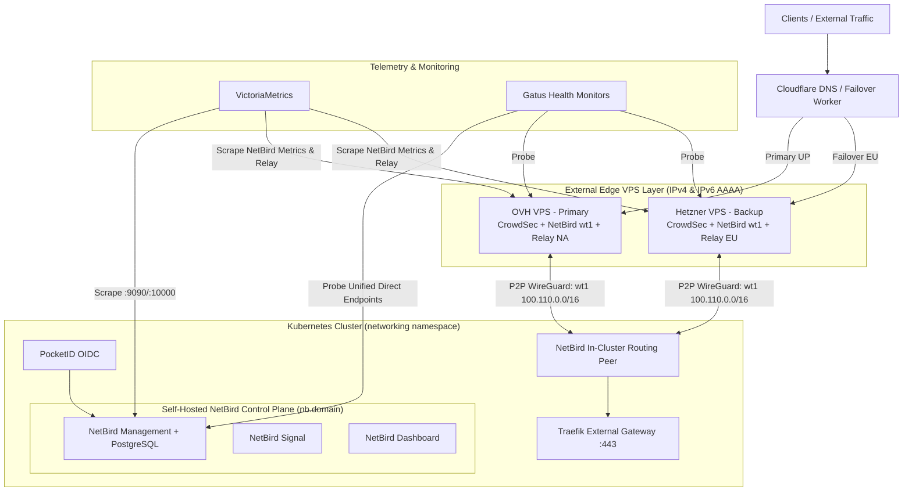

# Self-Hosted NetBird Architecture Evaluation & Phased Implementation Plan

## 1. Executive Summary & Architectural Vision

With external VPS nodes (OVH North America and Hetzner Europe) operational,
this plan evaluates and defines the migration from the custom **Towonel**
tunnel stack and commercial **NetBird Cloud** (`api.netbird.io`) to a
**fully self-hosted NetBird stack** deployed at `nb.${SECRET_DOMAIN}` within
the `networking` namespace.

### Target Multi-Tier Failover Hierarchy

Once deployed and validated, the ingress and overlay topology will follow a
strict three-tier failover structure:

1. **Tier 1 (Primary)**: Ingress via **Self-Hosted NetBird Reverse Proxy**
   (Primary OVH VPS $\rightarrow$ NetBird WireGuard mesh $\rightarrow$ Traefik
   External Gateway `10.0.10.20:443`).
2. **Tier 2 (Secondary Edge)**: Ingress via **Self-Hosted NetBird Reverse Proxy**
   (Backup Hetzner VPS $\rightarrow$ NetBird WireGuard mesh $\rightarrow$
   Traefik).
3. **Tier 3 (Cloud Overlay Fallback)**: Ingress via **NetBird Cloud Overlay**
   (`wt0` mesh fallback).
4. **Tier 4 (Emergency Fallback)**: Cloudflare Tunnel directly to Traefik
   Gateway.



---

## 2. Upstream NetBird Documentation Review & Key Findings

### 2.1 NetBird Reverse Proxy Feature Completeness vs. Towonel

- **Maturity & Capabilities**: NetBird v0.35+ provides native Reverse Proxy
  capabilities supporting:
  - **Layer 4 (TLS Passthrough / TCP / UDP)**: Transparently routes SNI-based
    TLS traffic across the WireGuard tunnel directly to internal endpoints
    (e.g. Traefik) without terminating certificates at the edge.
  - **Layer 7 (HTTP / HTTPS)**: Path-based routing, header preservation
    (`X-Forwarded-For`, PROXY protocol support), and optional IdP/PIN auth.
- **Why Traefik is Required**: NetBird self-hosted reverse proxy requires
  **Traefik** as its underlying proxy engine for TLS passthrough support.
  Since our cluster ingress standard is already Traefik Gateway API, this
  matches our infrastructure natively.
- **Towonel Replacement Verdict**: **Fully capable**. Towonel acted primarily as
  a custom multiplexing TLS/TCP tunnel between VPS nodes and the cluster.
  NetBird's WireGuard mesh + Reverse Proxy/TLS passthrough provides superior
  performance, kernel-space WireGuard encryption, Rosenpass post-quantum
  security, and eliminates bespoke Go daemons.

### 2.2 Geo-Distributed STUN / TURN / Relay Architecture & IPv6 Publication

- **Embedded STUN**: In current NetBird versions, STUN functionality is embedded
  directly within the **NetBird Relay** daemon (`netbirdio/relay`), rendering
  standalone Coturn containers obsolete.
- **Geo-Distributed Deployment on VPS Nodes**:
  - STUN and WireGuard Relays **require public IPv4 and IPv6 addresses** and
    uninhibited UDP/TCP connectivity for remote peer NAT traversal.
  - NetBird Relay containers are deployed on the **external VPS nodes** (OVH
    North America and Hetzner Europe) rather than behind the home router's NAT.
  - OpenTofu (`main.tf`) will publish both **`A` (IPv4)** and **`AAAA` (IPv6)**
    DNS records for `vps-primary.${SECRET_DOMAIN}` and
    `vps-backup.${SECRET_DOMAIN}` on Cloudflare.
  - In-cluster `netbird-management` configures these VPS relay endpoints in its
    `management.json`:
    - `stun:vps-primary.${SECRET_DOMAIN}:3478` /
      `rels://vps-primary.${SECRET_DOMAIN}:33073`
    - `stun:vps-backup.${SECRET_DOMAIN}:3478` /
      `rels://vps-backup.${SECRET_DOMAIN}:33073`
- **Relay & STUN Metrics**: NetBird Relay exposes Prometheus metrics via
  `NB_METRICS_PORT=9090` (tracking active relay sessions, allocations,
  handshake timing, and byte transfer rates).

### 2.3 Subnet Allocation (RFC 6598 CGNAT Compliance)

- **Cloud NetBird Subnet**: Currently allocated at `100.100.0.0/16`.
- **Work Subnet**: User uses `100.64.0.0/16`.
- **Self-Hosted NetBird Subnet**: Configured explicitly to **`100.110.0.0/16`**
  (in `management.json` under `Network.Net`), which resides safely within the
  RFC 6598 Carrier-Grade NAT block (`100.64.0.0/10` $\rightarrow$
  `100.64.0.0`–`100.127.255.255`) and guarantees zero IP collisions across all
  networks.

### 2.4 Declarative Policy & Dual-Mesh Operator Architecture

- **Upstream Operator Single-Instance Invariant**: Upstream `netbird-operator` hardcodes
  cluster-wide watchers across all namespaces for all NetBird CRDs. Attempting to run dual
  operators simultaneously causes cache panics and reconciliation collisions.
- **Self-Hosted Operator Target**:
  - `netbird-operator` connects directly to the in-cluster self-hosted management server
    (`http://netbird-management.networking.svc.cluster.local:8080`) using `NB_SELFHOSTED_API_KEY`.
  - Reconciles declarative `NetworkRouter`, `NBResource`, `NBGroup`, and `NBPolicy` CRs
    against the self-hosted PostgreSQL database with zero API rate limiting.
- **Cloud Fallback Mesh**:
  - Maintained via a standalone declarative `Deployment` (`netbird-cloud-client`) running
    in `networking` namespace connected to `https://api.netbird.io:443`.
  - Connects using `SETUP_KEY` from `Secret/netbird`, advertising all internal subnets
    and cluster domains without requiring a second operator.

### 2.5 CrowdSec nftables Bouncer Integration

- On modern Debian (Bookworm/Trixie), `nftables` is the native Linux packet
  filtering framework.
- The VPS nodes will use `crowdsec-firewall-bouncer-nftables` with atomic set
  lookups, protecting the host, SSH, and NetBird WireGuard/Relay ports by
  dropping malicious layer-3 packets before they enter the tunnel.

### 2.6 Telemetry & Capacity Monitoring

- **Prometheus Endpoints**:
  - `netbird-management`: Exposes Prometheus metrics on port `9090` (`/metrics`).
  - `netbird-signal`: Exposes Prometheus metrics on port `10000` (`/metrics`).
  - `netbird-relay` (VPS nodes): Exposes Prometheus metrics on port `9090`
    (`/metrics`).
- **Client & Peer Metrics**: WireGuard interface counters (`rx_bytes`,
  `tx_bytes`, packet loss, handshake timing) will be scraped via `node_exporter`
  / `VMStaticScrape` on both VPS nodes.
- **Capacity Planning Dashboard**: Dedicated Grafana dashboard tracking network
  throughput (Mbps), cumulative monthly egress/ingress (GB/TB), and connection
  concurrency to guide future VPS resizing and provider selection.

### 2.7 PocketID Identity Provider & Advanced Management Sync

- **Upstream Reference**: [NetBird Self-Hosted PocketID IdP Integration](https://docs.netbird.io/selfhosted/identity-providers/advanced/pocketid).
- **Public Client & PKCE Flow**:
  - PocketID client is configured as a public client (`isPublic: true`) with PKCE enabled (`pkceEnabled: true`).
  - Callback URLs registered:
    - `http://localhost:53000` (for local CLI browser PKCE login).
    - `https://nb.${SECRET_DOMAIN}/auth` (dashboard login redirect).
    - `https://nb.${SECRET_DOMAIN}/silent-auth` (dashboard silent token refresh).
  - Legacy endpoints `/callback` and `/silent-callback` are deprecated in NetBird v0.35+ and omitted.
- **Token Source & Device Flow**:
  - `NETBIRD_TOKEN_SOURCE: "idToken"` and `NETBIRD_AUTH_DEVICE_AUTH_USE_ID_TOKEN: "true"`.
  - `NETBIRD_AUTH_DEVICE_AUTH_PROVIDER: "none"` disables the standalone OAuth device authorization flow in favor of standard PKCE browser authentication (`http://localhost:53000`).
- **Group Synchronization**:
  - `NETBIRD_AUTH_SUPPORTED_SCOPES` and dashboard `AUTH_SUPPORTED_SCOPES` include `openid profile email groups`, enabling automatic PocketID user group mapping into NetBird access control policies.
- **Management API Key & IdP Sync Configuration**:
  - NetBird management connects directly to PocketID's management API to query and reconcile users.
  - Secret value `NB_POCKETID_MANAGEMENT_APIKEY` is synced from Bitwarden item `Netbird Service Credentials` via External Secrets Operator.
  - **Schema Invariant (`management.json`)**: In NetBird's Go config parser, `ManagementEndpoint` and `ApiToken` must reside under `IdpManagerConfig.ExtraConfig` (not `ClientConfig.Extra`):

    ```json
    "IdpManagerConfig": {
      "ManagerType": "pocketid",
      "ClientConfig": {
        "ClientID": "netbird",
        "ClientSecret": ""
      },
      "ExtraConfig": {
        "ManagementEndpoint": "https://id.${SECRET_DOMAIN}",
        "ApiToken": "$NETBIRD_IDP_MGMT_EXTRA_API_TOKEN"
      }
    }
    ```

    _Placing `Extra` under `ClientConfig` causes startup failure with `failed to create IDP service: pocketId IdP configuration is incomplete, ManagementEndpoint is missing`._
- **Bitwarden Item Name Uniqueness Invariant**:
  - Bitwarden CLI (`bw get item <name>`) performs substring search. If multiple items contain the search term
    (e.g. `Netbird Credentials` matching both `Netbird Credentials` and `Netbird DB Credentials`), Bitwarden CLI returns `HTTP 400: More than one result was found`.
  - Bitwarden vault items used by ExternalSecrets must be uniquely named (e.g. `Netbird Service Credentials`).

---

## 3. Benefits, Risks & Mitigations

### 3.1 Key Benefits

- **Complete Infrastructure Sovereignty**: Retires commercial NetBird Cloud limits
  and Cloudflare proxy MITM, returning 100% control of traffic and encryption keys
  to the self-hosted cluster.
- **Stack Simplification**: Replaces two disparate networking layers
  (NetBird Cloud + Towonel) with one unified, high-performance WireGuard overlay.
- **Zero-Trust SSO with PocketID**: Integrated directly with in-cluster PocketID
  via OIDC with passkeys, MFA, and automated group syncing.
- **Low-Latency Direct Mesh**: Direct UDP 51821 P2P WireGuard between VPS edge
  nodes and home cluster with automatic fallback to high-speed VPS-hosted
  STUN/TURN relays.
- **Unified Direct Ingress for Heavy Services**: Removes Cloudflare proxy upload
  limits (100MB), timeouts, and streaming throttling for Plex, Immich, and Restic
  REST Server by routing them directly through the unproxied VPS NetBird mesh.

### 3.2 Risks & Mitigations

- **Parallel Client Conflicts on VPS** (Severity: Medium):
  Run separate systemd services (`netbird` on `wt0` vs `netbird-selfhosted` on
  `wt1`) with isolated config directories (`/etc/netbird-selfhosted`), separate
  unix sockets (`/var/run/netbird-selfhosted.sock`), and distinct subnets
  (`100.100.0.0/16` vs `100.110.0.0/16`).
- **Control Plane Unavailability during Home Outages** (Severity: Medium):
  Established WireGuard sessions remain active and routable even if the Management
  server is unreachable. Management DB state is persisted to Ceph-CSI block storage
  with hourly Volsync/Restic replication.
- **DNS Split-Brain** (Severity: Low):
  Managed entirely declaratively via ExternalDNS and Cloudflare API using GitOps.

---

## 4. Phased Implementation Plan

### Phase 1: Deploy Self-Hosted NetBird Control Plane in `networking` Namespace

1. **PocketID OIDC Client Registration**:
   - Create `PocketIDOIDCClient` CR named `netbird` in `cluster/apps/networking/netbird/control-plane/oidc-client.yaml`:
     - Public client (`isPublic: true`) with PKCE enabled (`pkceEnabled: true`).
     - Callback URLs: `http://localhost:53000`, `https://nb.${SECRET_DOMAIN}/auth`, `https://nb.${SECRET_DOMAIN}/silent-auth`.
     - Allowed groups: `admin` and `users` under `auth` namespace.
2. **Control Plane Deployment (`cluster/apps/networking/netbird/control-plane/`)**:
   - Deploy `management` (PostgreSQL backed, network CIDR `100.110.0.0/16`, metrics on port 9090, PKCE auth, `IdpManagerConfig.ExtraConfig` for PocketID management API sync).
   - Deploy `signal` (WebSockets signaling, metrics on port 10000).
   - Deploy `dashboard` (React UI on port 80, `AUTH_REDIRECT_URI: /auth`, `AUTH_SILENT_REDIRECT_URI: /silent-auth`, `AUTH_SUPPORTED_SCOPES: "openid profile email groups"`).
3. **Traefik Gateway API & ExternalDNS**:
   - Create Traefik `HTTPRoute` for `nb.${SECRET_DOMAIN}` pointing to dashboard and management API.
   - Configure ExternalDNS annotations for automated Cloudflare DNS record provisioning.
4. **Telemetry & Gatus Setup**:
   - Configure `ServiceMonitor` for NetBird management (`:9090`) and signal (`:10000`).
   - Add Gatus endpoint monitors for `https://nb.${SECRET_DOMAIN}` and `/api/health`.

### Phase 2: VPS Dual-Daemon NetBird Client & Relay Deployment (with IPv6)

1. **OpenTofu & DNS Updates (`cluster/apps/networking/towonel/ingress-vps/`)**:
   - Export public IPv6 addresses in `main.tf` and publish `AAAA` records for `vps-primary.${SECRET_DOMAIN}` and `vps-backup.${SECRET_DOMAIN}` on Cloudflare.
2. **Cloud-Init & Systemd Updates**:
   - Keep existing `netbird` service running on `wt0` (Cloud NetBird at `100.100.0.0/16`).
   - Add `netbird-selfhosted.service` systemd unit running on interface `wt1` with socket `/var/run/netbird-selfhosted.sock` and config `/etc/netbird-selfhosted/config.json`.
   - Add `netbird-relay` container on VPS with embedded STUN (`NB_ENABLE_STUN=true`, ports 3478 UDP / 33073 TCP) and metrics (`NB_METRICS_PORT=9090`).
   - Migrate firewall bouncer to `crowdsec-firewall-bouncer-nftables`.
3. **Setup Key Enrollment**:
   - Provision a setup key in self-hosted NetBird with auto-groups `vps-nodes` and `routing-peers`.
   - Connect VPS nodes to `https://nb.${SECRET_DOMAIN}` via `wt1`.
4. **VPS Telemetry & Gatus Monitoring**:
   - Configure `VMStaticScrape` to collect interface counters for both `wt0` and `wt1`, plus relay metrics on OVH and Hetzner.
   - Deploy Gatus external monitors probing VPS health and WireGuard interface reachability.

### Phase 3: In-Cluster Routing Peer, Dual-Mesh Architecture & Operator Switch

1. **Operator Target Switch**:
   - Switched `netbird-operator` to target `http://netbird-management.networking.svc.cluster.local:8080` with `NB_SELFHOSTED_API_KEY`.
   - Reconciles `NetworkRouter/k8s` in `networking` namespace connected to the self-hosted mesh (`100.111.0.0/16`).
2. **Cloud Fallback Mesh Client**:
   - Deployed standalone `Deployment/netbird-cloud-client` in `networking` namespace connected to `https://api.netbird.io:443`.
   - Maintains full route advertisement for `100.100.0.0/16` fallback.
3. **Declarative Policy & Group Syncing**:
   - Configured `NBGroup` (`all`, `vps-nodes`, `routing-peers`, `users`, `admin-users`) and `NBPolicy` rules on the self-hosted control plane.
4. **Validation**:
   - Verified active WireGuard tunnels on both `netbird-cloud-client` (`100.100.x.x`) and `networkrouter-k8s` (`100.111.x.x`).

### Phase 4: Edge Reverse Proxy Proof-of-Concept

1. Configure NetBird Reverse Proxy (TLS Passthrough) on VPS nodes over `wt1` targeting `10.0.10.20:443`.
2. Deploy a test hostname `test-ingress.${SECRET_DOMAIN}` pointing to the primary VPS.
3. Verify:
   - SNI preservation and TLS termination at Traefik.
   - Real client IP header forwarding and PROXY protocol support.
   - CrowdSec IP reputation blocking on the VPS host before traffic enters the proxy.

### Phase 5: Production Failover Reconfiguration & Towonel Retirement

1. **Unify Direct Public Services**:
   - Migrate all public services (Plex, Immich, Restic REST Server, etc.) away from Cloudflare proxying to the direct VPS NetBird reverse proxy pipeline.
   - Standardize Gatus health checks across all services with uniform `https://${SERVICE}.${SECRET_DOMAIN}` probes.
2. **Update Failover Monitor**:
   - Update `failover-monitor.js` Cloudflare Worker to manage the new failover chain:
     - **Primary**: OVH VPS NetBird Reverse Proxy (`vps-primary.${SECRET_DOMAIN}`).
     - **Secondary**: Hetzner VPS NetBird Reverse Proxy (`vps-backup.${SECRET_DOMAIN}`).
     - **Tertiary**: NetBird Cloud mesh fallback.
     - **Quaternary**: Cloudflare Tunnel fallback.
3. **Cutover & Decommission**:
   - Point production `ingress.${SECRET_DOMAIN}` CNAME to the new pipeline.
   - Monitor live traffic, error rates, and throughput in Grafana for 72 hours.
   - Safely decommission Towonel manifests (`cluster/apps/networking/towonel/`) and clean up Towonel CRDs.

---

## 5. Strict GitOps Verification Plan

In accordance with our GitOps standards, no phase will be marked complete without end-to-end empirical verification and committed manifests.

### 5.1 Automated Manifest Validation

```bash
# Validate schemas, Flux kustomizations, and linting
mise x -- task test:all
```

### 5.2 Empirical Runtime Tests

1. **OIDC Authentication & Management API**:
   - `curl -fsS https://nb.${SECRET_DOMAIN}/api/health` returns `200 OK`.
   - Complete PocketID SSO login on `https://nb.${SECRET_DOMAIN}` and verify token issuance.

2. **Dual VPS Interface, IPv6 & Peer Verification**:
   - Verify AAAA records resolve correctly:

     ```bash
     dig AAAA vps-primary.${SECRET_DOMAIN} +short
     dig AAAA vps-backup.${SECRET_DOMAIN} +short
     ```

   - SSH to OVH and Hetzner VPS nodes and run:

     ```bash
     netbird --daemon-addr unix:///var/run/netbird-selfhosted.sock status -d
     ip addr show dev wt1
     ip route show table all
     ```

   - Verify `wt0` (`100.100.x.x`) and `wt1` (`100.110.x.x`) are concurrently active with 0 packet drops.

3. **End-to-End SNI & Reverse Proxy Validation**:
   - Direct resolve probe across edge VPS:

     ```bash
     curl -Iv --resolve "test-ingress.${SECRET_DOMAIN}:443:<VPS_IP>" "https://test-ingress.${SECRET_DOMAIN}"
     ```

   - Confirm TLS certificate returned belongs to the in-cluster Traefik service and headers reflect valid client IP.

4. **Data Usage & Metrics Validation**:
   - Verify Prometheus targets in VictoriaMetrics UI (`/targets`) for NetBird Management (`:9090`), Signal (`:10000`), VPS NetBird Relays (`:9090`), and VPS node interfaces (`wt0`/`wt1`).
   - Verify Grafana Data Usage Dashboard reflects live inbound/outbound transfer rates.

5. **Failover Execution Test**:
   - Stop `netbird-selfhosted` on Primary VPS $\rightarrow$ verify Cloudflare Worker updates DNS to Backup VPS within 60 seconds.
