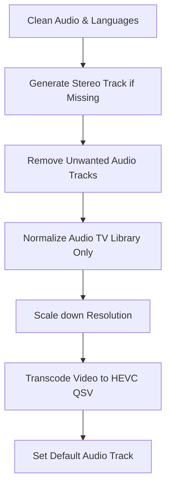

<!-- markdownlint-disable MD013 -->

# Tdarr Library Optimization & Safe Testing Guide

This guide outlines how to configure Tdarr to optimize your media libraries (Movies, TV, and Other) for size and performance, while ensuring absolute safety against data loss.

---

## 1. Addressing the Data Loss Issue

In Tdarr, original file replacement is the default behavior if an explicit Output Folder is not configured. However, even when an Output Folder _is_ configured, files can be lost due to:

- **"Delete source file" option:** When an Output Folder is defined, Tdarr displays an option to delete the source file after copy. If this is checked, the original file is deleted.
- **Plugin overrides:** Certain custom/community plugins contain internal FFMPEG scripts that might output back to the source directory or handle replacement in an uncoordinated manner.
- **Permission or Path Mapping Mismatches:** If the server and nodes do not see the paths identically, files can be processed into a cache directory and then fail to copy, leaving the original deleted or orphaned in cache.

### Mitigating the Risk (Safe Testing Strategy)

#### Strategy A: Read-Only Media Mounts (Recommended for Initial Setup)

Since you are managing the cluster via GitOps, the absolute safest way to test is to temporarily configure your media volumes as **read-only** in the Helm Release. If Tdarr attempts to delete or write back to the source folder, it will fail with a permission error, ensuring your source files remain 100% untouched.

You can modify [tdarr-server's helm-release.yaml](../cluster/apps/media/tdarr-server/app/helm-release.yaml) and [tdarr-node's helm-release.yaml](../cluster/apps/media/tdarr-node/app/helm-release.yaml) like this:

```yaml
movies:
  type: nfs
  server: "${CORE_NFS_SERVER:=nas0}"
  path: /mnt/user/Movies
  globalMounts:
    - path: /Movies
      readOnly: true # <--- Set to true temporarily
```

#### Strategy B: The Sandbox Testing Method

1. **Create a Sandbox Share:** Create a folder on your NAS, e.g., `/mnt/user/OtherStorage/tdarr-sandbox/`.
2. **Create Source & Destination folders:**
   - `/mnt/user/OtherStorage/tdarr-sandbox/test-src/`
   - `/mnt/user/OtherStorage/tdarr-sandbox/test-out/`
3. **Copy Sample Files:** Copy 5-10 test files with different characteristics (a 4K HDR movie, a 1080p TV show episode with 5.1 audio, an older 480p stereo video, etc.) into `test-src/`.
4. **Define a Test Library in Tdarr:** Point a new Tdarr library (e.g., `Sandbox-Test`) to `/other/tdarr-sandbox/test-src/` with output folder `/other/tdarr-sandbox/test-out/`.
5. **Disable "Delete source file"** in the library options.
6. Run the transcode. Confirm that `test-src/` is unchanged, and `test-out/` contains your newly transcoded media.

---

## 2. Ideal Encoding & Downscaling Values

Since your Tdarr Node has an Intel GPU allocated (`gpu.intel.com/i915: 1`), you should leverage **Intel Quick Sync Video (QSV)** (`hevc_qsv` encoder) rather than CPU (`libx265`).

- **QSV HEVC (H.265)** transcodes at extremely high speeds (100–300+ FPS) while keeping CPU utilization minimal.
- Instead of CRF (Constant Rate Factor), Intel QSV uses **ICQ (Intelligent Constant Quality)** or **LA_ICQ (Look-Ahead Intelligent Constant Quality)**.

### Target Value Matrix

| Library    | Max Resolution           | Video Encoder / Quality                     | Audio Streams to Keep              | Volume Leveling         |
| :--------- | :----------------------- | :------------------------------------------ | :--------------------------------- | :---------------------- |
| **Movies** | **1080p** (No upscaling) | H.265 QSV (ICQ `24`)                        | Immersive (5.1/7.1) + Stereo (2.0) | None                    |
| **TV**     | **1080p** (No upscaling) | H.265 QSV (ICQ `24`)                        | Immersive (5.1/7.1) + Stereo (2.0) | Yes (Stereo track only) |
| **Other**  | **720p** (No upscaling)  | H.265 QSV (ICQ `28` - Higher space savings) | Stereo (2.0) Only                  | None                    |

> [!WARNING]
> **A Note on 4K HDR Content:** Downscaling a 4K HDR (High Dynamic Range) video to 1080p without **HDR-to-SDR Tone Mapping** will result in washed-out, gray-looking colors.
>
> - If you have 4K HDR movies/TV shows you wish to downscale, you must include a tone-mapping filter block (`tonemap`, `zscale` or local filter) in your transcode arguments.
> - _Recommendation:_ Consider keeping your 4K HDR library in a separate folder that Tdarr does not process, downscaling only standard 4K SDR or excluding 4K entirely from Tdarr's sweep.

---

## 3. Classic Plugins vs. Tdarr Flows: Which to Use?

You should absolutely use **Tdarr Flows** rather than Classic Plugins.

### Why Flows are the Superior Choice

- **Visual Conditional Branching:** Classic plugins are executed in a strict linear stack. Setting up conditions like _"If resolution is 4K and it has HDR, apply tone mapping and downscale, but if it is 1080p SDR, just transcode to HEVC"_ is extremely messy and prone to conflicts in a linear stack. Flows make this branching trivial and visual.
- **Active Development & Community Support:** Tdarr's creator and the community have shifted focus to Flows. Classic plugins are legacy and mostly in maintenance mode. Most modern templates and new hardware-specific optimizations are released as Flow templates.
- **Granular Debugging:** In Flows, you can click on each individual block in a finished job report to see exactly what input it received and what output/FFmpeg arguments it generated. In Classic, you have to parse a single, massive text log.
- **Fail-safes:** Flow blocks have built-in safety routes (e.g. "On Error" paths), allowing you to route failed transcodes to a Discord alert or move them to a separate folder rather than crashing the worker queue.

---

## 4. Tdarr Configuration Implementations

### Option A: Configuration using Tdarr Flows (Recommended)

You can construct these flows using the drag-and-drop builder in the Tdarr UI:

#### Flow 1: Movies

1. **Input File** node.
2. **Filter (Has Video):** If false, end flow (preserves audio-only files if any).
3. **Check Video Codec:** If already `hevc` (H.265), skip to Audio steps.
4. **Check Video Resolution:**
   - If resolution is `4K` (2160p) or greater: Route to **Transcode & Scale** node. Set output resolution to `1920x1080`. Set video encoder to `hevc_qsv`, quality/ICQ to `24`, and ensure HDR-to-SDR tone mapping is enabled if downscaling HDR.
   - If resolution is `1080p` or lower: Route to **Transcode (Keep Resolution)** node. Set video encoder to `hevc_qsv`, quality/ICQ to `24`.
5. **Audio Filter & Reorder:**
   - Filter language: Keep English (or your preferred language tracks).
   - **Check Audio Channels:** If a 5.1/7.1 track is present, but **no** 2.0 (Stereo) track exists, route to **Downmix Audio** node (5.1/7.1 to 2.0 Stereo AAC).
   - Keep the original immersive track (5.1/7.1) and the (possibly new) stereo track. Drop all other tracks (commentary, secondary languages).
6. **Set Default Audio Track:** Set the default track to 2.0 Stereo (for compatibility) or 5.1 Surround (depending on preference).
7. **Output File / Replace** (Only enable replacement after testing!).

#### Flow 2: TV Shows

- **Exact same as Movies Flow**, but add an **Audio Normalizer** node right after the Audio Downmixing step.
- **Important:** Configure the Audio Normalizer (which uses the `loudnorm` filter) to target **only** the 2.0 Stereo track. Normalizing immersive 5.1/7.1 audio can destroy its native dynamic range.

#### Flow 3: Other

1. **Input File** node.
2. **Filter (Has Video)**.
3. **Check Video Codec:** If already `hevc` (H.265) and resolution is `<= 720p`, skip to Audio steps.
4. **Check Video Resolution:**
   - If resolution is higher than 720p (e.g. 1080p, 4K): Route to **Transcode & Scale** node. Set output resolution to `1280x720`. Set video encoder to `hevc_qsv`, quality/ICQ to `28`.
   - If resolution is `<= 720p`: Route to **Transcode** node. Set video encoder to `hevc_qsv`, quality/ICQ to `28`.
5. **Audio Processing:**
   - If contains a 5.1/7.1 track, run a **Downmix Audio** node to create a 2.0 Stereo AAC track.
   - Keep **only** the 2.0 Stereo track. Discard all 5.1/7.1 tracks, commentary tracks, and foreign languages.
6. **Output File / Replace**.

---

### Option B: Configuration using Classic Plugins

If you prefer classic plugin stacks, search for and configure these community plugins in your library tab in this exact order:



#### 1. Movies Library Plugin Stack

1. **`Tdarr_Plugin_MC93_Migz3CleanAudio`**
   - _Purpose:_ Removes commentary tracks, descriptive audio, and keeps only specified languages (e.g. `eng`).
2. **`Tdarr_Plugin_MC93_Migz5ConvertAudio`**
   - _Purpose:_ Automatically downmixes a 5.1/7.1 track to a 2.0 stereo AAC track if the video does not already have a 2.0 track.
3. **`Tdarr_Plugin_00td_action_remove_audio_by_channel_count`**
   - _Purpose:_ Set this to remove tracks that aren't 2 channels (Stereo) or 6 channels (5.1). This drops extra tracks like 7.1 or mono if you do not want them.
4. **`Tdarr_Plugin_d5id_Keep_1080p_Lower_Resolution`**
   - _Purpose:_ Downscales any video resolution higher than 1080p down to 1080p, while leaving 1080p and lower resolutions untouched.
5. **`Tdarr_Plugin_bsh1_Boosh_FFMPEG_QSV_HEVC`** (or `Tdarr_Plugin_MC93_Migz1FFMPEG` with QSV selected)
   - _Purpose:_ Transcodes video to H.265 using Intel Quick Sync Video.
6. **`Tdarr_Plugin_c0r1_SetDefaultAudioStream`**
   - _Purpose:_ Sets the default audio track flag (e.g., pointing to the stereo track for max device compatibility).

#### 2. TV Library Plugin Stack

1. **`Tdarr_Plugin_MC93_Migz3CleanAudio`**
2. **`Tdarr_Plugin_MC93_Migz5ConvertAudio`**
3. **`Tdarr_Plugin_00td_action_remove_audio_by_channel_count`**
4. **`Tdarr_Plugin_NIfPZuCLU_2_Pass_Loudnorm_Audio_Normalisation`**
   - _Purpose:_ Analyzes and normalizes audio track volume levels using a 2-pass EBU R128 `loudnorm` filter.
5. **`Tdarr_Plugin_d5id_Keep_1080p_Lower_Resolution`**
6. **`Tdarr_Plugin_bsh1_Boosh_FFMPEG_QSV_HEVC`**
7. **`Tdarr_Plugin_c0r1_SetDefaultAudioStream`**

#### 3. Other Library Plugin Stack

1. **`Tdarr_Plugin_MC93_Migz3CleanAudio`**
2. **`Tdarr_Plugin_00td_action_keep_one_audio_stream`**
   - _Purpose:_ Strips out all secondary/immersive audio channels so that only a single track is kept.
3. **`Tdarr_Plugin_MC93_Migz5ConvertAudio`**
   - _Purpose:_ Converts that single remaining track to a 2-channel Stereo AAC stream if it wasn't already stereo.
4. **`Tdarr_Plugin_075a_Transcode_Customisable`**
   - _Purpose:_ In the custom arguments, use a scaling filter (`-vf scale=1280:-2`) and QSV HEVC arguments (`-c:v hevc_qsv -global_quality 28`) to scale everything down to max 720p and compress it heavily.

---

## 5. Advanced Audio & Subtitle Considerations

### Protecting Special Audio Channel Counts (Mono Safety)

- **Mono (1.0 Channel) tracks:** If you have classic movies (e.g. black-and-white films) or old cartoons, they frequently only have 1.0 mono audio. A strict plugin that removes everything except `2.0` and `5.1/7.1` could strip out the mono track, leaving you with a silent file.
- **Failsafe:** Ensure your Flows/plugins use a "Keep at least one audio track" filter or explicitly add Mono (`1`) to the list of channels to keep.

### Multi-language & Anime Tracks

- If you watch foreign-language films or Anime, you will want to keep the original audio track (e.g. Japanese, French, Spanish) along with the English Dub.
- Configure the **Language Filter** node/plugin to keep a comma-separated list of target languages: `eng, jpn, spa, fre` (using ISO 639-2 three-letter codes) rather than just English.

### Commentary & Audio Description Tracks

- Many Blu-ray rips contain Director's commentary tracks, which are usually stereo (2.0).
- If you keep all stereo tracks, you'll end up keeping these.
- In Tdarr, you can exclude tracks that contain keywords in their titles (e.g. `commentary`, `description`, `visual impaired`, `hearing impaired`) to clean up these extra streams without losing the main stereo track.

### Subtitle Preservation (Do NOT Strip Subtitles)

- Subtitles take up virtually zero space (typically 50KB to 2MB per movie), but losing them is frustrating. Make sure your flows **do not strip subtitle tracks**.
- **PGS/SUP vs. SRT subtitles:** PGS subtitles (found on Blu-ray rips) are image-based. Many web browsers and TV clients (like Jellyfin web/Tizen/WebOS) cannot render PGS. When you try to play a video with PGS subtitles, your media server is forced to transcode the video on-the-fly to "burn" the subtitles in.
- _Recommendation:_ Use a Tdarr Flow node (like **Subtitles - Extract & Convert**) to convert PGS subtitles to text-based **SRT** format, or at least ensure SRT tracks are kept as preferred.

---

## 6. System & Client Compatibility Concerns

### HDR/Dolby Vision Metadata Preservation

- If you are transcoding H.265 to H.265 (to save space on bloated 4K files), you must preserve the 10-bit HDR10/Dolby Vision metadata.
- Make sure your Intel QSV encoder arguments use the 10-bit color pixel format (`-pix_fmt p010le`) and appropriate color profiles (`-colorspace bt2020nc -color_trc smpte2084 -color_primaries bt2020`).
- Standard 8-bit transcoding of HDR content will strip the color maps, leaving you with ruined, gray media.

### Standardizing Container Formats (Remuxing to MKV)

- Standardize your library on the **MKV (Matroska)** container format. MKV is highly flexible, supporting almost all audio formats (DTS-HD, TrueHD, Atmos), multiple subtitle formats, and multiple audio tracks.
- Use a Tdarr node at the start of your flow to **remux container** (convert `.mp4`, `.avi`, `.wmv` to `.mkv`). Remuxing is instant because it does not transcode the video/audio stream; it just swaps the outer shell wrapper.

### Storage I/O & SSD Wear on CephFS

- In your cluster, `tdarr-shared-cache` is backed by `ceph-filesystem` (CephFS).
- During transcoding, the node copies the original file to `/temp` (CephFS), writes the temporary transcoded file there, and then copies it back to NFS. This means you are writing double the file size over CephFS.
- If your Ceph cluster is backed by consumer SSDs, running Tdarr continuously across a multi-terabyte library will write massive amounts of data, which accelerates SSD wear (TBW limits).
- _Recommendation:_ If your nodes have local fast NVMe SSDs, or if you can mount a `tmpfs` (RAM disk) on the node to use as a local cache rather than a network claim, it will speed up transcoding and reduce CephFS write wear.

### Triggering Jellyfin Library Scans

- After Tdarr completes a transcode and replaces the file, Jellyfin might not detect the change immediately, or it might show duplicate entries.
- Add a post-transcode hook node to **Notify Jellyfin** via API, triggering an automatic partial scan of the folder that was just modified.

---

## 7. Test Verification Plan

To verify the setup:

1. **Execution Check:** Trigger the `Sandbox-Test` library scan and transcode.
2. **File Analysis (Mediainfo):** Use tools like `mediainfo` or VLC's codec details on the output files inside `/other/tdarr-sandbox/test-out/` to verify:
   - **Resolution:** Output is max 1080p for Movies/TV, and max 720p for Other.
   - **Video Codec:** Confirmed as HEVC (H.265).
   - **Audio Streams:** Correct number of tracks (2 for Movies/TV: one Stereo AAC, one Surround; 1 track for Other: Stereo AAC).
   - **Volume level (TV only):** Audio is normalized (check by listening to the output or checking with an audio tool).
3. **Logs Verification:** View the Tdarr transcode log. Look for the FFMPEG command line executed by the node. Ensure it includes `-c:v hevc_qsv` (Intel QSV) and does **not** fallback to CPU software encoding (`libx265`), which would show high CPU utilization.
