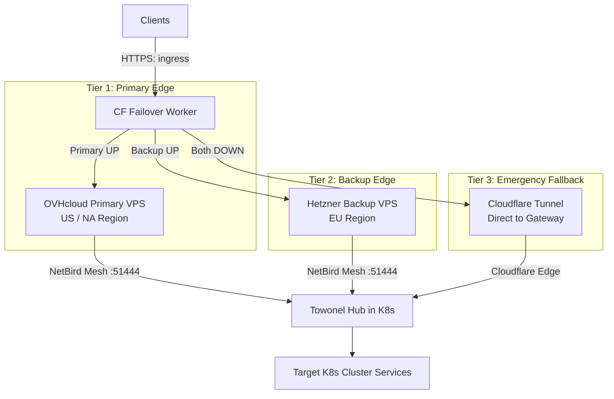
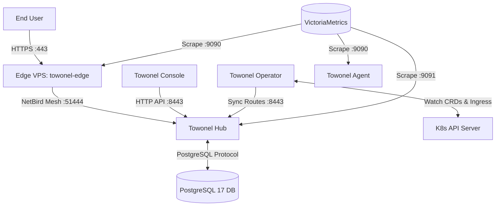

# Towonel Stack Architecture & Operations Guide

This document provides a comprehensive operational and architectural guide for
the **Towonel** networking, ingress, and edge failover infrastructure in
`home-cluster`.

---

## 1. Directory Organization

The Towonel stack is organized into three decoupled subpackages under
`cluster/apps/networking/towonel/`:

```text
cluster/apps/networking/towonel/
├── control-plane/             # Central Towonel Control Plane
│   ├── console-helmrelease.yaml # Towonel Console Web UI (port 3000)
│   ├── hub-helmrelease.yaml     # Towonel Hub (Control Plane & Server)
│   ├── externalsecret.yaml     # Secrets (towonel-hub-secrets)
│   ├── oidc-client.yaml        # PocketID OIDC Client Registration
│   └── kustomization.yaml
├── operator/                  # Kubernetes Ingress Operator
│   ├── app/
│   │   ├── helmrelease.yaml    # Towonel Kubernetes Operator
│   │   └── kustomization.yaml
│   └── agents/
│       ├── agent-cr.yaml       # TowonelAgent CRD definition
│       └── kustomization.yaml
├── ingress-vps/               # Edge Ingress Nodes & Failover
│   ├── main.tf                 # OpenTofu Dual-VPS, DNS & Worker
│   ├── vps-cloud-init.yaml     # VPS Bootstrap Cloud-Init Config
│   ├── failover-monitor.js     # Cloudflare Worker Cron Script
│   └── app/
│       ├── external-secret.yaml # Secrets (ingress-tunnel-secrets)
│       ├── gitrepo.yaml        # Flux GitRepository for OpenTofu
│       ├── tofu.yaml           # Flux Terraform CR for VPS
│       ├── rbac.yaml           # ServiceAccount & RBAC for runner
│       ├── vm-static-scrape.yaml # VictoriaMetrics Scrape Config
│       ├── vps-direct-route.yaml # Traefik HTTPRoute for direct probe
│       ├── dashboard.yaml      # Towonel Traffic Dashboard
│       └── kustomization.yaml
└── ks.yaml                     # Consolidated Flux Kustomization
```

---

## 2. Secrets & Credentials Management

The Towonel infrastructure uses two centralized `ExternalSecret` definitions in
the `networking` namespace, syncing from Bitwarden:

### 2.1 Control Plane Secrets (`towonel-hub-secrets`)

Defined in `control-plane/externalsecret.yaml`:

| Secret Key                        | Description                                      | Source Vault Item             | Consumed By                  |
| :-------------------------------- | :----------------------------------------------- | :---------------------------- | :--------------------------- |
| `POSTGRES_USER` / `POSTGRES_PASS` | PostgreSQL DB credentials                        | `Postgres Credentials`        | Hub DB Init & Hub container  |
| `TOWONEL_HUB_DB_DSN`              | Connection string for PostgreSQL database        | `Towonel Service Credentials` | Towonel Hub                  |
| `TOWONEL_IDENTITY_KEY`            | Hub Node Private Identity Key                    | `Towonel Service Credentials` | Towonel Hub                  |
| `TOWONEL_HUB_KEK`                 | Key Encryption Key for data protection           | `Towonel Service Credentials` | Towonel Hub                  |
| `TOWONEL_INVITE_HASH_KEY`         | Key for tenant invite hashing                    | `Towonel Service Credentials` | Towonel Hub                  |
| `TOWONEL_HUB_LINK_PSK`            | Pre-Shared Key for Edge-to-Hub link verification | `Towonel Service Credentials` | Towonel Hub & VPS Edge nodes |
| `TOWONEL_HUB_OPERATOR_API_KEY`    | Admin API Key for Towonel Operator               | `Towonel Service Credentials` | `towonel-operator`           |
| `TOWONEL_K8S_OPERATOR_API_KEY`    | K8s Operator API Key for synchronization         | `Towonel Service Credentials` | `towonel-operator`           |

### 2.2 VPS & Infrastructure Secrets (`ingress-tunnel-secrets`)

Defined in `ingress-vps/app/external-secret.yaml`:

| Secret Key                                                                                                  | Description                                        | Source Vault Item                | Consumed By                 |
| :---------------------------------------------------------------------------------------------------------- | :------------------------------------------------- | :------------------------------- | :-------------------------- |
| `ovh_endpoint` / `ovh_application_key` / `ovh_application_secret` / `ovh_consumer_key` / `ovh_service_name` | OVHcloud Public Cloud API credentials & Project ID | `OVH Credentials`                | OpenTofu Runner (`main.tf`) |
| `hcloud_token`                                                                                              | Hetzner Cloud API Token                            | `Hetzner Credentials`            | OpenTofu Runner (`main.tf`) |
| `CLOUDFLARE_APIKEY`                                                                                         | Cloudflare API Token for DNS & Workers             | `Cloudflare Credentials`         | OpenTofu Runner & Worker    |
| `netbird_setup_key`                                                                                         | NetBird Setup Key for VPS mesh peer enrollment     | `Netbird Credentials`            | VPS `cloud-init`            |
| `towonel_hub_link_psk`                                                                                      | Pre-Shared Key for Edge-to-Hub authentication      | `Towonel Service Credentials`    | VPS `cloud-init`            |
| `tunnel_handshake_token`                                                                                    | Handshake token for backup tunneling               | `Fast Reverse Proxy Credentials` | VPS `cloud-init`            |
| `smtp_server` / `smtp_username` / `smtp_password`                                                           | Mailgun SMTP credentials for failover alerting     | `Mailgun Credentials`            | Cloudflare Worker Script    |

---

## 3. High Availability Dual-VPS & Ingress Architecture

Traffic ingress relies on a multi-region, three-tier failover topology that
dynamically steers public traffic to the healthiest edge ingress endpoint.



### 3.1 Tiered Failover Logic

A Cloudflare Worker (`failover-monitor.js`) runs every minute via cron trigger
(`cloudflare_workers_cron_trigger`):

1. **Tier 1 (Primary)**: Probes `https://vps-primary.${SECRET_DOMAIN}/`. If it
   returns HTTP `< 500`, the CNAME record for `ingress.${SECRET_DOMAIN}` is set
   to `vps-primary.${SECRET_DOMAIN}`.
2. **Tier 2 (Backup)**: If Primary probe fails (HTTP $\ge 500$ or timeout), it
   probes `https://vps-backup.${SECRET_DOMAIN}/`. If healthy,
   `ingress.${SECRET_DOMAIN}` CNAME is updated to `vps-backup.${SECRET_DOMAIN}`.
3. **Tier 3 (Fallback)**: If both Primary and Backup fail,
   `ingress.${SECRET_DOMAIN}` CNAME is pointed to `TUNNEL_CNAME` (Cloudflare
   Tunnel).
4. **Email Notification**: On any state transition, the Worker opens a direct
   TLS socket over port 465 to the Mailgun SMTP server (`sendEmailViaSMTP`) and
   sends a diagnostic alert email describing the state change.

### 3.2 Direct Health Probes & Gateway API Parity

To allow unproxied health checks to succeed during failover states:

- Unproxied `A` records (`vps-primary.${SECRET_DOMAIN}` and
  `vps-backup.${SECRET_DOMAIN}`) target the physical public IPv4 of the
  respective VPS nodes.
- Traefik Gateway API routes these hostnames via `vps-direct-route.yaml`
  (`vps-direct-health` HTTPRoute) so the TLS SNI negotiation completes
  successfully with a healthy HTTP `200` response.

---

## 4. Control Plane & Data Flow



1. **Edge Ingress**:
   - External HTTPS requests hit `towonel-edge` container on the active VPS.
   - `towonel-edge` encapsulates traffic and routes it across the private NetBird
     overlay mesh to `towonel-hub.networking.svc.cluster.local:51444` using
     `TOWONEL_HUB_LINK_PSK`.
   - `towonel-hub` terminates the tunnel and dispatches traffic to target
     internal Kubernetes cluster services.

2. **Control Plane Sync**:
   - `towonel-console` communicates directly with `towonel-hub` via internal
     cluster DNS `http://towonel-hub.networking.svc.cluster.local:8443`.
   - `towonel-operator` monitors K8s Ingress and `TowonelAgent` CRDs, calling
     `towonel-hub` API endpoints to dynamically update tenant routing rules.

---

## 5. Observability & Telemetry

### 5.1 VictoriaMetrics Scraping

Scraping is configured via `ingress-vps/app/vm-static-scrape.yaml`
(`VMStaticScrape` CRs):

- **North America Primary Edge (`towonel-edge-na`)**: Scraped at Primary VPS public IP `:9090` via `/metrics`.
- **Europe Backup Edge (`towonel-edge-eu`)**: Scraped at Backup VPS public IP `:9090` via `/metrics`.
- **Towonel Hub (`towonel-hub`)**: Scraped at `towonel-hub.networking.svc.cluster.local:9091`.
- **Towonel Agent (`towonel-agent`)**: Scraped at `towonel-agent.networking.svc.cluster.local:9090`.
- All scrape jobs attach `cluster: towonel-ops` to feed the Towonel Console and Grafana analytics.

### 5.2 Grafana Dashboard

A dedicated Grafana dashboard CR is deployed via
`ingress-vps/app/dashboard.yaml`:

- **Dashboard Name**: `towonel-traffic-analytics` (Folder: `networking`)
- **Key Metrics Tracked**:
  - Network Throughput (Mbps) by direction (`inbound` / `outbound`)
  - Outbound vs. Inbound Network Bandwidth
  - Service-level bandwidth consumption and 30-day transfer totals
  - Edge active connection counts and error rates

---

## 6. Initial Bootstrap & Onboarding Workflow

When bootstrapping a fresh Towonel installation or re-deploying the control
plane, follow these setup steps:

### Step 1: Database & Control Plane Launch

- Apply `ks.yaml` to deploy the `towonel` Flux Kustomization.
- Flux runs PostgreSQL initialization and launches `towonel-hub` and
  `towonel-console`.

### Step 2: OIDC Provider Setup & Operator Signup Invite

- Create the OIDC Client CRD (`oidc-client.yaml`) in PocketID / Authelia.
- Generate an initial signup invite with `role=operator` on the Towonel Hub:

```bash
curl -X POST https://towonel-hub.${SECRET_DOMAIN}/api/v1/signup-invites \
  -H "Authorization: Bearer <TOKEN>" \
  -H "Content-Type: application/json" \
  -d '{"role": "operator"}'
```

- Extract the returned `signup_code` (e.g. `Nra*-*kU`).

### Step 3: OIDC Authentication & Account Creation

- Initiate the OIDC authorization flow passing the generated `signup_code`:

```text
https://towonel-hub.${SECRET_DOMAIN}/api/v1/auth/oidc/codeberg/start?signup_code=<SIGNUP_CODE>
```

- Complete authentication via the OIDC provider (PocketID). The authenticated
  user will be registered with the `operator` role and granted administration
  access to Towonel Hub and Console.

### Step 4: Operator API Key Generation & Deployment

- In the Towonel Console / Hub UI, navigate to **Settings > API Keys**.
- Generate an **Operator API Key** for Kubernetes cluster sync.
- Add this key to Bitwarden under property `K8S_OPERATOR_API_KEY` on item
  `Towonel Service Credentials`.
- External Secrets Operator (`externalsecret.yaml`) syncs the key to
  `towonel-hub-secrets`.
- Flux reconciles `towonel-operator` and `ingress-vps` Kustomizations.

---

## 7. Operations & Maintenance Procedures

### 7.1 Infrastructure Lifecycle via OpenTofu Controller

Edge VPS infrastructure is managed declaratively by the Flux `Terraform` CR
(`tofu.yaml`):

```bash
# Check reconciliation status of the VPS infrastructure
kubectl describe terraform/ingress-tunnel-vps -n networking

# Force reconciliation of OpenTofu state
flux reconcile kustomization towonel-ingress-vps --with-source
```

### 7.2 Inspecting VPS Edge Nodes

If an edge node requires investigation:

```bash
# SSH into the VPS (from allowed IPs in firewall)
ssh admin@vps-primary.${SECRET_DOMAIN}

# Verify Docker container status
docker ps -a

# Inspect Towonel Edge logs
docker logs -f towonel-edge

# Check NetBird mesh connection status
netbird status
```

### 7.3 Verifying Failover Execution

To test failover response:

1. Temporarily stop the `towonel-edge` container on the primary VPS:

   ```bash
   ssh admin@vps-primary.${SECRET_DOMAIN} "sudo systemctl stop docker"
   ```

2. Wait 60 seconds for the Cloudflare Worker cron trigger to run.
3. Verify that `ingress.${SECRET_DOMAIN}` DNS updates to
   `vps-backup.${SECRET_DOMAIN}`.
4. Verify receipt of the alert notification email via Mailgun.
5. Restart Docker on the primary node to trigger automatic recovery:

   ```bash
   ssh admin@vps-primary.${SECRET_DOMAIN} "sudo systemctl start docker"
   ```
