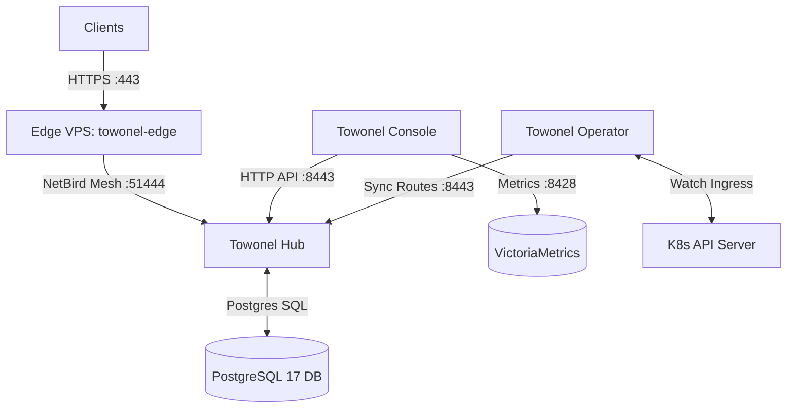

# Towonel Stack Architecture & Operations Guide

This directory consolidates all infrastructure, control plane, operator, and
ingress components for the Towonel networking system in `home-cluster`.

---

## 1. Directory Organization

```text
cluster/apps/networking/towonel/
├── control-plane/             # Central Towonel Control Plane
│   ├── console-helmrelease.yaml # Towonel Console Web Management UI
│   ├── hub-helmrelease.yaml     # Towonel Hub (Control Plane & Tunnel Server)
│   ├── externalsecret.yaml     # Shared Secret Definitions (towonel-hub-secrets)
│   ├── oidc-client.yaml        # PocketID / Authelia OIDC Client Registration
│   └── kustomization.yaml
├── operator/                  # Kubernetes Ingress Operator
│   ├── app/
│   │   ├── helmrelease.yaml    # Towonel Kubernetes Operator HelmRelease
│   │   └── kustomization.yaml
│   └── agents/
│       ├── agent-cr.yaml       # Towonel Agent CRD definition
│       └── kustomization.yaml
├── ingress-vps/               # Edge Ingress Node (Hetzner Cloud VPS)
│   ├── main.tf                 # OpenTofu Hetzner VPS & Firewall manifest
│   ├── vps-cloud-init.yaml     # VPS Bootstrap Cloud-Init configuration
│   ├── failover-monitor.js     # Edge Health & Probe failover script
│   └── app/
│       ├── external-secret.yaml
│       ├── gitrepo.yaml        # Flux GitRepository for OpenTofu controller
│       ├── tofu.yaml           # Flux Terraform CR for VPS infrastructure
│       ├── vm-static-scrape.yaml # VictoriaMetrics scrape config for VPS & Hub
│       └── vps-direct-route.yaml # Traefik HTTPRoute for VPS direct probing
└── ks.yaml                     # Consolidated Flux Kustomization manifest
```

---

## 2. Shared Secrets & Credentials Management

All components in the Towonel stack consume centralized secrets defined in
`control-plane/externalsecret.yaml`:

- **Secret Name**: `towonel-hub-secrets` (Namespace: `networking`)
- **Sources**: Bitwarden Vault (`bitwarden-login` and `bitwarden-fields` via
  External Secrets Operator).

### Secret Keys Summary

| Secret Key                        | Description                                   | Consumed By                                  |
| :-------------------------------- | :-------------------------------------------- | :------------------------------------------- |
| `POSTGRES_USER` / `POSTGRES_PASS` | PostgreSQL DB credentials                     | Hub Init Container & Hub main app            |
| `TOWONEL_HUB_DB_DSN`              | Connection string for PostgreSQL database     | Towonel Hub                                  |
| `TOWONEL_IDENTITY_KEY`            | Hub Node Private Identity Key                 | Towonel Hub                                  |
| `TOWONEL_HUB_KEK`                 | Key Encryption Key for data protection        | Towonel Hub                                  |
| `TOWONEL_INVITE_HASH_KEY`         | Key for tenant invite hashing                 | Towonel Hub                                  |
| `TOWONEL_HUB_LINK_PSK`            | Pre-Shared Key for Edge-Hub link verification | Towonel Hub & VPS Edge Node (`towonel-edge`) |
| `TOWONEL_HUB_OPERATOR_API_KEY`    | Admin API Key for Towonel Operator            | `towonel-operator`                           |
| `TOWONEL_K8S_OPERATOR_API_KEY`    | K8s Operator API Key for synchronization      | `towonel-operator`                           |

---

## 3. Data & Connection Flows



1. **Ingress Data Flow**:
   - External HTTPS requests hit the Edge VPS (`towonel-edge` docker container
     on Hetzner Cloud).
   - `towonel-edge` encapsulates traffic and routes it across the private NetBird
     overlay mesh to `towonel-hub.networking.svc.cluster.local:51444` using
     `TOWONEL_HUB_LINK_PSK` authentication.
   - `towonel-hub` terminates the tunnel and dispatches traffic to target
     internal Kubernetes cluster services.

2. **Control Plane Flow**:
   - `towonel-console` communicates directly with `towonel-hub` via internal
     cluster DNS `http://towonel-hub.networking.svc.cluster.local:8443`.
   - `towonel-operator` monitors K8s Ingress and `TowonelAgent` CRDs, calling
     `towonel-hub` API endpoints to dynamically update tenant routing rules.

---

## 4. Initial Bootstrap & Onboarding Workflow

When bootstrapping a fresh Towonel installation or re-deploying the control
plane, follow these initial setup steps:

### Step 1: Database & Control Plane Launch

- Apply `ks.yaml` to create the `towonel` Flux Kustomization.
- Flux deploys PostgreSQL database initialization and launches `towonel-hub`
  and `towonel-console`.

### Step 2: OIDC Provider Setup & Operator Signup Invite

- Create the OIDC Client CRD (`oidc-client.yaml`) in PocketID / Authelia to
  generate `towonel-hub-oidc-credentials`.
- Generate an initial signup invite with `role=operator` on the Towonel Hub:

```bash
curl -X POST https://towonel-hub.${SECRET_DOMAIN}/api/v1/signup-invites \
  -H "Authorization: Bearer <TOKEN>" \
  -H "Content-Type: application/json" \
  -d '{"role": "operator"}'
```

- Extract the returned `signup_code` (e.g. `Nra*-*kU`).

### Step 3: OIDC Authentication & Account Creation

- Initiate the OIDC authorization flow passing the generated `signup_code`:

```text
https://towonel-hub.${SECRET_DOMAIN}/api/v1/auth/oidc/codeberg/start?signup_code=<SIGNUP_CODE>
```

- Complete authentication via the OIDC provider (e.g. Codeberg / PocketID).
  The authenticated user will be registered with the `operator` role and
  granted full administration access to Towonel Hub and Console.

### Step 4: Operator API Key Generation & Deployment

- Log into Towonel Console or Hub as the operator administrator and navigate
  to API Keys / Settings.
- Generate an **Operator API Key** for Kubernetes cluster sync.
- Add this key to Bitwarden under property `K8S_OPERATOR_API_KEY` (or
  `OPERATOR_API_KEY`) on item `Towonel Service Credentials`.
- External Secrets Operator (`externalsecret.yaml`) syncs the key to
  `towonel-hub-secrets`.
- Flux reconciles `towonel-operator` and `ingress-vps` Kustomizations
  (`dependsOn: towonel`).
