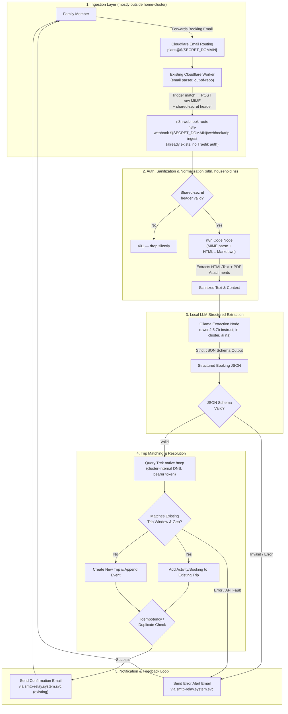

<!-- markdownlint-disable MD013 -->

# Trip Ingestion & Itinerary Pipeline (TripIt Replacement) — TDD/SDD

**Document ID**: SDD-2026-TREK-INGEST
**Status**: Draft / Revised — feasibility-reviewed against live cluster state
**Target Systems**: `n8n`, `ollama`, `trek`, `cloudflare-tunnel`, `external-secrets`, `traefik`, Cloudflare Email Routing (external, out-of-repo)
**Repository**: `home-cluster`

---

## 0. Feasibility Review Summary

This revision was checked directly against the running cluster (Flux-reconciled manifests, live `trek` MCP endpoint) rather than assumed from general TripIt-replacement patterns. The original draft was directionally sound but made several assumptions that don't match this cluster. Corrected below; see [§8 Critical Decisions](#8-critical-decisions--rationale) for the full rationale on each.

| Original assumption                                                                              | Reality in this cluster                                                                                                                                                   | Impact                                                                                                                                        |
| :----------------------------------------------------------------------------------------------- | :------------------------------------------------------------------------------------------------------------------------------------------------------------------------ | :-------------------------------------------------------------------------------------------------------------------------------------------- |
| New IMAP mailbox or generic inbound-webhook needed for ingestion                                 | An email-parsing Cloudflare Worker already exists and can fire an HTTPS request on a matched trigger; `smtp-relay` (maddy) is outbound-only and cannot receive/store mail | Drop Option A (IMAP) entirely. Use the existing Worker as the sole ingestion trigger — see §3.1                                               |
| `n8n-webhook.${SECRET_DOMAIN}/webhook/trip-ingest` needs to be created                           | The `n8n` HelmRelease already defines this exact route (`external-gateway`, `PathPrefix /webhook`, `traefik-middleware-chain-no-auth`)                                    | No new HTTPRoute needed. But the route has **zero** Traefik-level auth today — the workflow itself must validate a shared secret (§3.1, §8.5) |
| `ClusterSecretStore: bitwarden-secrets-manager`                                                  | Only `bitwarden-fields`, `bitwarden-login`, `bitwarden-notes` exist                                                                                                       | All ExternalSecrets below use `bitwarden-fields`                                                                                              |
| Trek reached via REST token or an optional ToolHive `mcp-trek` wrapper                           | Trek already ships a native `/mcp` endpoint (bearer-token auth, independent of its `OIDC_ONLY` human-login mode) and is actively used this way                            | Skip the ToolHive wrapper — redundant per the repo's DRY rule. Call Trek's own MCP endpoint directly over cluster-internal DNS (§3.3, §8.2)   |
| Success/failure notifications via a new Mailgun/Postmark SMTP integration                        | `smtp-relay` (maddy, `system` namespace) already relays outbound mail for `${SECRET_DOMAIN}` through Mailgun                                                              | Reuse `smtp-relay:2525`; no new outbound-mail credentials (§3.4, §8.3)                                                                        |
| `cluster/apps/household/n8n/app/workflows/trip-ingest.json` "declaratively" defines the workflow | n8n has no built-in file-watch import; the running workflow lives in the SQLite state on its PVC                                                                          | Needs an explicit sync mechanism — proposed as an n8n Public API sync Job (§4.3, §8.4)                                                        |
| `ollama` sized generically                                                                       | Cluster runs `ollama` with 2 replicas, each holding one dedicated Intel iGPU (`gpu.intel.com/i915: 1`), not a discrete GPU                                                | The doc's "<10s per email" latency target is optimistic for a 7–8B model on iGPU — treat as a soft target, validate empirically (§8.6)        |

Everything else in the original design (JSON extraction schema, trip-matching algorithm, failure-mode table) held up and is carried forward with edits noted inline.

---

## 1. Executive Summary & Problem Statement

### 1.1 Background

Commercial travel itinerary aggregators (such as TripIt) offer convenience by allowing users to forward booking emails (flights, hotels, car rentals, activities) to an ingestion address, parsing the unstructured or HTML text with proprietary extractors, and building a consolidated trip itinerary. However, proprietary solutions present major drawbacks:

- Privacy concerns (exposing travel dates, loyalty numbers, family member names, locations, and financial data to third-party ad networks/vendors).
- Subscription paywalls for basic features (gate changes, calendar sync, offline export).
- Vendor lock-in without declarative, local data ownership.

### 1.2 Objective

Design and specify a private, resilient, low-maintenance, and GitOps-declarative (where the tooling actually supports it — see §8.4) travel ingestion pipeline that replaces TripIt. The system allows family members to forward any reservation email to a dedicated address, extracts structured itinerary data using a self-hosted local LLM (`ollama`), matches or creates trips in `trek` via its native MCP endpoint, and provides automated confirmation or failure notifications.

---

## 2. Architectural Design & System Topology



**Namespace/ownership map:**

| Component                                            | Namespace       | GitOps-managed here?                                              |
| :--------------------------------------------------- | :-------------- | :---------------------------------------------------------------- |
| Cloudflare Email Routing rule + Worker trigger logic | Cloudflare edge | **No** — lives in the Worker's own repo/Wrangler deploy. See §8.1 |
| n8n (trigger validation, MIME parse, orchestration)  | `household`     | Yes (already deployed; workflow content synced per §4.3)          |
| `ollama` (extraction)                                | `ai`            | Yes (already deployed)                                            |
| `trek` (trip store + native MCP)                     | `household`     | Yes (already deployed)                                            |
| `smtp-relay` (outbound notification mail)            | `system`        | Yes (already deployed)                                            |
| `cloudflare-tunnel` (edge → `traefik-external`)      | `networking`    | Yes (already deployed, unchanged by this design)                  |

---

## 3. Detailed Component Specifications

### 3.1 Email Ingestion Layer — Cloudflare Worker Trigger (Recommended)

This supersedes the original draft's Option A (dedicated IMAP mailbox) and
Option B (generic inbound-webhook provider) entirely.

The original draft proposed either a dedicated IMAP mailbox or a generic inbound-email-provider webhook. Both are unnecessary: **there is already a Cloudflare Worker bound to email-routing traffic that inspects incoming mail and can issue an HTTPS request on a matched trigger.** This is a better fit than either original option:

- No in-cluster mail store is needed (`smtp-relay`/maddy is relay-only and explicitly rejects inbound mail for storage — `default_source { reject }` — so Option A would have required standing up a full IMAP-capable MTA from scratch).
- No new inbound ingress is needed — the target endpoint (`n8n-webhook.${SECRET_DOMAIN}/webhook/trip-ingest`) already exists in the `n8n` HelmRelease's `webhook` route.
- The Worker already runs at the Cloudflare edge, so the request to `n8n-webhook.${SECRET_DOMAIN}` is a normal internet HTTPS call through the same Cloudflare Tunnel path every other external hostname on this cluster uses (`cloudflare-tunnel` → `traefik-external` → the route's backend). No special-casing required on the tunnel/ingress side.

#### Trigger design

1. **Recipient alias**: Route `plans@${SECRET_DOMAIN}` (Cloudflare Email Routing) to the existing Worker. Family members forward booking emails here.
2. **Worker match condition**: Add a rule to the existing Worker — if `message.to` equals the plans alias (or a per-member alias like `brandon-plans@${SECRET_DOMAIN}` if per-person routing is preferred later), fire the forward. All other addresses/rules the Worker already handles are untouched.
3. **Payload**: Stream `message.raw` (the raw RFC-822 MIME, headers + body + attachments) directly as the POST body with `Content-Type: message/rfc822`. Do not pre-parse in the Worker — n8n's Code node (§3.1 MIME extraction below) already owns that job, and keeping the Worker dumb keeps the two systems loosely coupled.
4. **Required headers on the Worker's outbound request**:
   - `X-Trip-Ingest-Secret: <shared secret>` — see §3.1 Auth below.
   - `X-Envelope-From: <message.from>` — n8n needs this to know who to reply to; it's not reliably in the MIME body's visible `From:` header when forwarded.
5. **Cloudflare inbound-email limits to design around** (affects §5 failure modes): message size ceiling (~25 MB) and Worker CPU/subrequest limits — large PDF-heavy itineraries could hit this. Not a blocker for typical airline/hotel confirmations, but should reject-and-bounce gracefully rather than truncate silently.

#### Auth (critical — see §8.5)

Two independent gates protect this path, since Traefik applies none:

1. **Sender allowlist (Worker-side, defense in depth).** Before doing anything else, the Worker checks the envelope `from` address via `isTrustedTripIngestSender()`: the sender must either be one of the family's own gmail forwarding targets, or an address matching one of `worker.js`'s existing `forwardingRules` (i.e. it wouldn't fall through to `defaultForward`). An untrusted sender is bounced immediately with `message.setReject(...)` — no request to n8n at all. This is a cheap deterrent, not real auth: envelope `from` is trivially spoofable without DMARC enforcement, so it only filters out opportunistic/scanner traffic, not a targeted spoof.
2. **Shared secret (n8n-side, the real gate).** The n8n `webhook` HTTPRoute uses `traefik-middleware-chain-no-auth` (it has to — n8n's own webhook path handles many different external triggers with different auth needs). **This means Traefik performs no authentication on this path.** The workflow's first node must validate `X-Trip-Ingest-Secret` against `TRIP_INGEST_SHARED_SECRET` from `n8n-trip-ingest-secrets` (ExternalSecret, §4.2) before any parsing happens, and short-circuit with a `401` (no body, no LLM call) on mismatch. This same secret value must also be provisioned into the Worker (`wrangler secret put TRIP_INGEST_SHARED_SECRET`) — that half is out-of-repo (§8.1).

#### MIME & Payload Extraction (unchanged from original draft, still valid)

- **Plain Text vs. HTML**: Many modern airline emails (e.g. United, Delta) embed tables and hidden attributes inside HTML. The preprocessor extracts the raw HTML, runs it through an HTML-to-Markdown converter (`turndown` / `html-to-text`), strips tracking pixels and stylesheet noise, and produces clean Markdown.
- **PDF Attachments**: If the email contains a `.pdf` attachment (e.g. boarding passes, European rail tickets, Airbnb receipts), n8n uses a `Read PDF` / `pdf-parse` node to extract text content and append it to the LLM prompt payload.
- Since the payload is now raw MIME (not a pre-split IMAP message object), the Code node needs a real MIME parser (e.g. `postal-mime` or `mailparser`) as its first step to split headers/body/attachments before the HTML-to-Markdown and PDF steps run.

---

### 3.2 LLM Extraction Engine (`ollama`) — unchanged design, revised risk note

#### Model Selection & Infrastructure

- **Model Recommendation**: `qwen2.5:7b-instruct` or `llama3.1:8b-instruct`. Both support structured JSON output schemas reliably.
- **Execution Target**: In-cluster `ollama` (2 replicas, each pinned to one Intel iGPU via `gpu.intel.com/i915: 1`, namespace `ai`) — already deployed, no changes needed to the HelmRelease.
- **Latency Target**: <10s per email extraction is the original goal, but **treat as a soft target, not a gate.** An Intel iGPU is meaningfully slower than a discrete GPU for a 7–8B model; validate empirically in Milestone 3 (§7) and fall back to a smaller/more aggressively quantized model (e.g. `qwen2.5:3b-instruct` or a `q4` quant of the 7B) if latency is unacceptable for interactive use.

#### Structured Output JSON Schema

The extraction prompt utilizes Ollama's `format` field with a strict JSON schema contract:

```json
{
  "$schema": "http://json-schema.org/draft-07/schema#",
  "title": "TravelReservationExtraction",
  "type": "object",
  "properties": {
    "booking_type": {
      "type": "string",
      "enum": [
        "flight",
        "lodging",
        "rental_car",
        "transit",
        "restaurant",
        "activity",
        "general"
      ]
    },
    "confirmation_code": {
      "type": "string",
      "description": "PNR, confirmation code, or reservation reference number"
    },
    "provider_name": {
      "type": "string",
      "description": "Airline, hotel chain, rental agency, or operator name"
    },
    "traveler_names": {
      "type": "array",
      "items": { "type": "string" }
    },
    "start_datetime": {
      "type": "string",
      "format": "date-time",
      "description": "ISO-8601 start/departure timestamp with timezone or local offset"
    },
    "end_datetime": {
      "type": "string",
      "format": "date-time",
      "description": "ISO-8601 end/arrival/checkout timestamp with timezone or local offset"
    },
    "segments": {
      "type": "array",
      "description": "Populated for multi-leg itineraries (connecting flights, multi-city trains); each entry mirrors the top-level flight/transit fields for one leg",
      "items": { "type": "object" }
    },
    "origin": {
      "type": "object",
      "properties": {
        "name": { "type": "string" },
        "code": {
          "type": "string",
          "description": "IATA/ICAO code if applicable (e.g. SFO)"
        },
        "address": { "type": "string" },
        "city": { "type": "string" },
        "country": { "type": "string" }
      }
    },
    "destination": {
      "type": "object",
      "properties": {
        "name": { "type": "string" },
        "code": {
          "type": "string",
          "description": "IATA/ICAO code if applicable (e.g. LHR)"
        },
        "address": { "type": "string" },
        "city": { "type": "string" },
        "country": { "type": "string" }
      },
      "required": ["city"]
    },
    "flight_details": {
      "type": "object",
      "properties": {
        "flight_number": { "type": "string" },
        "seat": { "type": "string" },
        "terminal": { "type": "string" },
        "gate": { "type": "string" }
      }
    },
    "lodging_details": {
      "type": "object",
      "properties": {
        "room_type": { "type": "string" },
        "check_in_time": { "type": "string" },
        "check_out_time": { "type": "string" }
      }
    },
    "financials": {
      "type": "object",
      "properties": {
        "total_amount": { "type": "number" },
        "currency": { "type": "string" }
      }
    },
    "notes": {
      "type": "string",
      "description": "Crucial details like cancellation policy, baggage rules, or access codes"
    }
  },
  "required": ["booking_type", "provider_name", "start_datetime", "destination"]
}
```

(Added `segments` to formalize the multi-leg case referenced in the original §5 failure-mode table — the original schema didn't actually declare that field.)

---

### 3.3 Trek Integration — Native MCP, No ToolHive Wrapper (Revised)

The original draft offered two integration paths: deterministic REST calls with an API token, or an _optional_ ToolHive Virtual MCP Gateway wrapper (`mcp-trek`). Neither is quite right for this cluster:

- **Trek already exposes its own `/mcp` endpoint natively**, independent of ToolHive, authenticated with a Trek-issued personal-access-style bearer token (works even with Trek's `OIDC_ONLY: "true"` human-login mode — the two auth paths are separate). This is proven working today.
- Wrapping an already-MCP-native app behind ToolHive's `mcp-trek.yaml` would just be a redundant hop, and the repo's DRY rule (CLAUDE.md #8) argues against it. **Do not add `cluster/apps/ai/toolhive/servers/mcp-trek.yaml`.**
- Call Trek directly over **cluster-internal DNS** (`http://trek.household.svc.cluster.local:3000/mcp`) rather than round-tripping out through `${GATUS_SUBDOMAIN}.${SECRET_DOMAIN}` and the Cloudflare Tunnel — same namespace, no reason to leave the cluster network.
- n8n's HTTP Request node (or its native MCP Client node, if present in the pinned n8n version — verify in Milestone 4; fall back to plain HTTP/JSON-RPC against `/mcp` if not) calls Trek's MCP tools directly: `list_trips`, `get_trip_summary`, `create_trip`, `create_reservation`, `create_accommodation`, `create_transport`, `create_transit_journey`.

#### Trip Resolution & Matching Algorithm

```text
                  ┌──────────────────────────────────┐
                  │  Parsed Reservation Data (JSON)  │
                  └─────────────────┬────────────────┘
                                    │
                                    ▼
                  ┌──────────────────────────────────┐
                  │  list_trips (Trek MCP) — Fetch   │
                  │   all Future & Active Trips       │
                  └─────────────────┬────────────────┘
                                    │
                                    ▼
       ┌────────────────────────────────────────────────────────────┐
       │ Does any Trip satisfy:                                     │
       │ 1. [Trip.StartDate - 3d <= Res.Start <= Trip.EndDate + 3d] │
       │    AND                                                     │
       │ 2. (Geo/City matches OR Country matches)                  │
       └──────────────┬──────────────────────────────┬──────────────┘
                      │ YES                          │ NO
                      ▼                              ▼
       ┌──────────────────────────────┐ ┌──────────────────────────────┐
       │   Match Found (Existing)     │ │        No Match Found        │
       │   Target: Trip ID            │ │  create_trip                 │
       │                              │ │  Title: "Trip to {City}"     │
       │                              │ │  Bounds: [Start, End]        │
       └──────────────┬───────────────┘ └──────────────┬───────────────┘
                      │                              │
                      └──────────────┬───────────────┘
                                     │
                                     ▼
                      ┌──────────────────────────────┐
                      │  get_trip_summary(trip_id)   │
                      │  scan reservations[] client- │
                      │  side for matching PNR/code  │
                      │  (Trek MCP has no server-side│
                      │  reservation search)          │
                      └──────────────┬───────────────┘
                                     │
                      ┌──────────────┴───────────────┐
                      │ Not Duplicate                │ Already Exists
                      ▼                              ▼
       ┌──────────────────────────────┐ ┌──────────────────────────────┐
       │ create_reservation /         │ │ update_reservation           │
       │ create_accommodation /       │ │ or log no-op                 │
       │ create_transport             │ │                              │
       └──────────────────────────────┘ └──────────────────────────────┘
```

1. **Window Tolerance**: A ±3 day buffer accounts for flights leaving before hotel check-in or red-eyes landing the following day.
2. **Trip Auto-Expansion**: If a newly added event starts before the current `trip.start_date` or ends after `trip.end_date`, expand the trip's date bounds via `update_trip`.
3. **Idempotency**: PNR / confirmation code is stored in the reservation's reference field. Trek's MCP has no server-side "search reservations by code" tool, so dedup is done by fetching the target trip's full summary (`get_trip_summary`) and scanning its `reservations[]` client-side in an n8n Code node before deciding create vs. update.
4. **Concurrency caveat** (new — see §8.7): two near-simultaneous forwards for the same new trip (e.g. flight + hotel emails arriving seconds apart from different family members) can race past the "does a matching trip exist" check before either has created one, producing two trips for the same window. Given expected household volume (a handful of forwards per trip, not concurrent-user scale), this is an accepted low-probability risk rather than something worth adding distributed locking for — but it should be called out in the confirmation email's "Undo/Edit" link so it's a one-click fix if it happens.

---

### 3.4 Notification & Human Feedback Loop — Reuses Existing `smtp-relay`

The original draft assumed a new SMTP integration (Postmark/Mailgun) would be configured directly in n8n. That's unnecessary: `smtp-relay` (`system` namespace, `maddy`, already relays `${SECRET_DOMAIN}` mail out through Mailgun) is already running and already has working outbound credentials.

1. **Success Confirmation** — n8n's `Send Email` node → SMTP `smtp-relay.system.svc.cluster.local:2525`, `From: plans@${SECRET_DOMAIN}` (matches maddy's configured source domain), `To:` the `X-Envelope-From` header captured in §3.1:
   - **Subject**: `✅ Added to Trek: {Provider} ({City}) - {Start Date}`
   - **Body Content**: Direct URL `https://${GATUS_SUBDOMAIN}.${SECRET_DOMAIN}/trips/{trip_id}`, a summary table of parsed items (Dates, Flight/Hotel, Confirmation Code, Cost), and an "Undo"/"Edit" deep link.
2. **Failure / Diagnostics Alert** — same SMTP path, recipient = sender + admin:
   - **Subject**: `⚠️ Failed to Process Travel Email: {Original Subject}`
   - **Body Content**: Failure reason (`LLM Schema Extraction Failure`, `Missing Destination Date`, `Trek API 500`), raw text excerpt extracted from the email, guidance on manual forwarding/formatting adjustments.
3. **Optional low-cost enhancement**: `ntfy` is already deployed in the `ai` namespace with no auth configured. A one-line HTTP POST to it from the same n8n branch gives near-instant push feedback (phone/desktop) ahead of the email round-trip, at effectively zero added infrastructure cost. Not required for v1 — flag as a follow-up, not a blocker.

---

## 4. GitOps & Declarative Cluster Implementation

### 4.1 Required Cluster Manifests & Files (Revised, and now built)

The original tree drops the ToolHive `mcp-trek` wrapper (§3.3/§8.2). The
workflow-sync mechanism landed as a **CronJob**, not the originally-sketched
one-shot `Job` — see §4.3 for why:

```text
cluster/apps/household/
├── n8n/
│   ├── app/
│   │   ├── helm-release.yaml           # Existing — webhook route already present; envFrom n8n-trip-ingest-secrets + N8N_BLOCK_ENV_ACCESS_IN_NODE: false added so the workflow can read the shared secret/Trek token
│   │   ├── externalsecret.yaml         # trip-ingest secret (IMAP removed; shared secret + Trek token + n8n API key)
│   │   ├── workflows/
│   │   │   └── trip-ingest.json        # Declarative n8n workflow export — source of truth in git, built and verified by hand first
│   │   └── workflow-sync-cronjob.yaml  # Periodic (every 15m) upsert of workflows/trip-ingest.json into n8n via its Public API (see §4.3)
└── trek/
    └── app/
        └── externalsecret.yaml         # Existing — extend with an API_TOKEN field on the same "Trek Service Credentials" Bitwarden item

cluster/apps/ai/
└── ollama/
    └── app/helm-release.yaml           # Existing — no changes required
```

Deliberately **not** added: `cluster/apps/ai/toolhive/servers/mcp-trek.yaml` (see §3.3/§8.2) and any IMAP-related manifests (see §3.1/§8.1).

### 4.2 ExternalSecret Declarations

Corrected to the store that actually exists in this cluster (`bitwarden-fields`, matching the `remoteRef.key`/`property` pattern already used by `trek`, `smtp-relay`, and `mcp-home-assistant`):

```yaml
apiVersion: external-secrets.io/v1
kind: ExternalSecret
metadata:
  name: n8n-trip-ingest-secrets
spec:
  refreshInterval: 15m
  secretStoreRef:
    kind: ClusterSecretStore
    name: bitwarden-fields
  target:
    name: n8n-trip-ingest-secrets
    template:
      data:
        TRIP_INGEST_SHARED_SECRET: "{{ .TRIP_INGEST_SHARED_SECRET }}"
        TREK_API_TOKEN: "{{ .TREK_API_TOKEN }}"
        N8N_API_KEY: "{{ .N8N_API_KEY }}"
  data:
    - secretKey: TRIP_INGEST_SHARED_SECRET
      remoteRef:
        key: "Trip Ingest Pipeline Credentials"
        property: "SHARED_SECRET"
    - secretKey: TREK_API_TOKEN
      remoteRef:
        key: "Trek Service Credentials" # reuse the existing item trek's own ExternalSecret already reads
        property: "API_TOKEN"
    - secretKey: N8N_API_KEY
      remoteRef:
        key: "Trip Ingest Pipeline Credentials"
        property: "N8N_API_KEY"
```

`TRIP_INGEST_SHARED_SECRET` must also be provisioned into the Cloudflare Worker (`wrangler secret put`) — that half of the value's lifecycle is outside this repo's SOPS/ESO reach (§8.1); document the manual step, don't pretend it's automated.

### 4.3 n8n Workflow GitOps Sync (built and verified — Milestone 5)

n8n has no equivalent of "mount a JSON file and it becomes the live workflow." The running workflow state lives in n8n's own DB on its PVC. Two mechanisms were considered:

- **n8n CLI `import:workflow`** run against the same SQLite file from a sidecar/initContainer: rejected — risks lock contention with the live, already-running n8n process against the same DB file on the shared PVC.
- **n8n Public API** (`PUT /api/v1/workflows/{id}`, authenticated with an n8n-generated API key): **used.** Safe against a running instance, idempotent upsert by the workflow's own ID.

**Deviation from the original sketch:** a one-shot `Job` re-triggered by `reloader.stakater.com/auto` doesn't actually work for this — Reloader's rollout-restart mechanism targets Deployments/StatefulSets/DaemonSets, and a bare `Job`'s spec is immutable after creation, so re-applying it on every ConfigMap change would fail. Built as a **CronJob** instead (`cluster/apps/household/n8n/app/workflow-sync-cronjob.yaml`), running every 15 minutes and idempotently PUTing the current `workflows/trip-ingest.json` (mounted via a `configMapGenerator`-backed ConfigMap, `n8n-trip-ingest-workflow`) to n8n's API. This is simpler than chasing Job-immutability workarounds, self-heals if someone edits the workflow by hand in the n8n UI (git wins on the next tick), and accepts up to ~15 minutes of propagation lag — acceptable for a household-scale pipeline.

```yaml
apiVersion: batch/v1
kind: CronJob
metadata:
  name: n8n-workflow-sync
spec:
  schedule: "*/15 * * * *"
  concurrencyPolicy: Forbid
  jobTemplate:
    spec:
      template:
        spec:
          restartPolicy: OnFailure
          containers:
            - name: sync
              image: curlimages/curl:8.11.0
              env:
                - name: WORKFLOW_ID
                  value: VPRsjZRxTBmywAdW
                - name: N8N_URL
                  value: http://n8n.household.svc.cluster.local:8080
              envFrom:
                - secretRef:
                    name: n8n-trip-ingest-secrets
              command: ["/bin/sh", "-c"]
              args:
                - |
                  curl -sf -X PUT \
                    -H "X-N8N-API-KEY: $N8N_API_KEY" \
                    -H "Content-Type: application/json" \
                    --data @/workflows/trip-ingest.json \
                    "$N8N_URL/api/v1/workflows/$WORKFLOW_ID"
              volumeMounts:
                - name: workflows
                  mountPath: /workflows
          volumes:
            - name: workflows
              configMap:
                name: n8n-trip-ingest-workflow
```

The workflow ID (`VPRsjZRxTBmywAdW`) is hardcoded — it's fixed once the workflow is created and doesn't change on subsequent edits, since upserts go through the same ID. Verified: `git`-tracked `workflows/trip-ingest.json` → `PUT /api/v1/workflows/{id}` → n8n reflects the change and the webhook still resolves correctly, all with the workflow active throughout.

---

## 5. Failure Modes, Resilience & Edge Cases

| Failure Mode                                         | Root Cause                                                                                                                        | Mitigation Strategy                                                                                                                                                                                                                                                                                                                               |
| :--------------------------------------------------- | :-------------------------------------------------------------------------------------------------------------------------------- | :------------------------------------------------------------------------------------------------------------------------------------------------------------------------------------------------------------------------------------------------------------------------------------------------------------------------------------------------ |
| **Malformed / Marketing Email**                      | Family member forwards a promotional email or newsletter without reservation info.                                                | LLM returns `booking_type: "general"` with empty fields; n8n aborts processing with graceful informational reply ("No booking found in email").                                                                                                                                                                                                   |
| **Multi-Leg Flight Itinerary**                       | Single confirmation email contains 3 connecting flights across different time zones.                                              | Schema's `segments: []` array (§3.2) is populated; n8n iterates and creates a reservation/transport entry per leg.                                                                                                                                                                                                                                |
| **PDF Ticket Only**                                  | Email body is blank; reservation details exist solely inside an attached PDF or Apple Wallet `.pkpass`.                           | n8n's MIME parser extracts the attachment from the raw message, then a PDF-text-extraction node feeds it into the Ollama prompt buffer.                                                                                                                                                                                                           |
| **Ollama Node OOM / Timeout**                        | Complex email causes LLM processing to exceed timeout, or Intel iGPU contention between the 2 replicas under concurrent forwards. | n8n implements retry logic (3 attempts, exponential backoff); routes to failure notification if exhausted. Revisit model size per §3.2/§8.6 if this recurs.                                                                                                                                                                                       |
| **Timezone Ambiguity**                               | Email states "Arrive at 8:00 AM" without explicit timezone.                                                                       | Preprocessor infers timezone from origin/destination airport IATA code via static lookup table (e.g. `LHR -> Europe/London`).                                                                                                                                                                                                                     |
| **Duplicate Forwards**                               | Multiple family members forward the exact same booking confirmation.                                                              | Dedup step (§3.3) checks the target trip's `get_trip_summary` for an existing item with matching `confirmation_code` + `provider_name` before insertion.                                                                                                                                                                                          |
| **Unauthenticated / spoofed webhook call** _(new)_   | The `n8n-webhook` HTTPRoute has no Traefik-level auth — it's reachable by anyone who guesses/finds the path.                      | Two layers (§3.1): the Worker's `isTrustedTripIngestSender()` sender-allowlist check bounces obviously-untrusted senders before n8n is ever called; the workflow's mandatory `X-Trip-Ingest-Secret` check is the real gate — non-matching or missing header = immediate 401, no LLM invocation (protects both privacy and Ollama compute budget). |
| **Cloudflare inbound-email size/CPU limits** _(new)_ | Large PDF-heavy itineraries could exceed the Worker's message-size ceiling (~25 MB) or CPU/subrequest budget.                     | Worker should bounce/reject with a clear NDR rather than silently truncating; document the ceiling for users.                                                                                                                                                                                                                                     |
| **Concurrent duplicate-trip creation** _(new)_       | Two forwards for the same not-yet-created trip race past the trip-matching check within seconds of each other.                    | Accepted low-probability risk at household scale (§8.7) — surfaced via the confirmation email's Edit/Undo link rather than solved with distributed locking.                                                                                                                                                                                       |

---

## 6. Test-Driven Development (TDD) & Verification Plan

### 6.1 Test Corpus & Fixtures

Create a git-versioned test fixture suite (`tests/fixtures/emails/`) containing anonymized raw `.eml` and `.html` files representing common providers:

- `flight_united_multileg.eml`
- `flight_delta_single.eml`
- `hotel_marriott_confirmation.html`
- `lodging_airbnb_receipt.eml`
- `rental_car_hertz.eml`
- `train_amtrak_pdf.eml`
- `restaurant_opentable.eml`
- `spam_promotional_newsletter.eml`

### 6.2 Test Phases

#### Phase 1: LLM Schema Extraction Accuracy Test

- **Input**: Feed each fixture into `ollama` with the structured JSON schema.
- **Assertion**:
  - Valid JSON schema output (100% pass rate).
  - Accurate PNR, departure/arrival timestamps, origin, destination city.
  - Zero hallucinations on missing data (null fields instead of made-up strings).
  - Empirically measure p50/p95 extraction latency against the Intel-iGPU `ollama` deployment — confirms or revises the §3.2 latency target before it's baked into the workflow's timeout config.

#### Phase 2: Trek Resolver Logic Unit Test

- **Scenarios**:
  - Ingest flight into non-existent trip -> `create_trip` with correct date bounds.
  - Ingest hotel overlapping existing trip dates -> attached to existing trip via `create_accommodation`.
  - Ingest duplicate confirmation -> skipped without error (verified against `get_trip_summary` scan).

#### Phase 3: Worker → Webhook Auth Test _(new)_

- POST directly to `n8n-webhook.${SECRET_DOMAIN}/webhook/trip-ingest` with a missing/incorrect `X-Trip-Ingest-Secret` and confirm the workflow short-circuits with no Ollama invocation.

#### Phase 4: End-to-End Ingestion Run

- Forward a real test email to `plans@${SECRET_DOMAIN}` and confirm it reaches the Worker's new trigger rule.
- Verify n8n execution log -> Ollama inference -> Trek MCP call -> confirmation email received via `smtp-relay`.
- Empirical verification of the trip in Trek's UI.

---

## 7. Implementation Milestones

- [x] **Milestone 1**: Trek API token confirmed working against the native `/mcp` endpoint (`initialize`, `tools/list`, `tools/call` all verified live). Stored as `API_TOKEN` on the "Trek Service Credentials" Bitwarden item.
- [x] **Milestone 2**: `plans@${SECRET_DOMAIN}` routing added to the Cloudflare Worker with a sender allowlist gate; `TRIP_INGEST_SHARED_SECRET` provisioned on both the Worker and the cluster. Verified live end-to-end through the real Cloudflare→Worker→webhook path.
- [x] **Milestone 3**: Ollama extraction tested against `mistral:latest` (already pulled; the doc's originally-recommended `qwen2.5:7b-instruct`/`llama3.1:8b-instruct` were never pulled and weren't worth the download given "not concerned about Ollama" from the principal). Found and fixed a real bug along the way: Ollama drops integrated GPUs by default (`OLLAMA_IGPU_ENABLE=1` fixes it) — cold-start dropped from 60s+ to ~16s, warm from ~11s. Extraction quality is inconsistent run-to-run (confirmed live: one run correctly extracted `booking_type`/date, another missed the date and provider entirely) — accepted as a known tradeoff per §8.6, mitigated by the confirmation-email human-in-the-loop.
- [x] **Milestone 4**: Full n8n orchestration workflow built and verified live: webhook (raw MIME, POST, `/webhook/trip-ingest`) → shared-secret gate (401 on mismatch) → Ollama extraction (Code node, `this.helpers.httpRequest` to `ollama.ai.svc.cluster.local`) → Trek resolution (Code node: raw MCP JSON-RPC over HTTP, session-per-execution, `list_trips` window-match or `create_trip`, `get_trip_summary` for day IDs, dedup by `confirmation_code`, `create_transport` for flight/transit or `create_reservation` otherwise) → notification (native `n8n-nodes-base.emailSend` node against `smtp-relay:2525`, no auth/TLS). n8n 2.37.4 has no native MCP Client node; raw JSON-RPC against `/mcp` is what's actually running, not a fallback-in-name-only.
- [x] **Milestone 5**: Stood up the n8n Public API sync as a CronJob (§4.3, not the originally-sketched Job — see rationale there) and proved the round-trip: edit `workflows/trip-ingest.json` in git → `PUT` applies it → n8n reflects the change, webhook still resolves correctly, without hand-editing in the n8n UI. **Caveat learned the hard way**: the CronJob runs every 15 minutes regardless of who last touched the workflow — editing live via the API (or the UI) without updating the git file first gets silently reverted on the next tick. Git is genuinely the source of truth; treat the CronJob as adversarial to any un-committed live edit.
- [x] **Milestone 6**: Declarative n8n workflow lives at `workflows/trip-ingest.json`, validated with `mise x -- task test:all`.

### 7.1 Known gaps / follow-ups

- **SMTP credential is not GitOps-tracked.** The `Notify` node's (originally `Notify Success`, renamed §9.1) `smtp-relay (internal, no auth)` credential (host `smtp-relay.system.svc.cluster.local:2525`, `secure: false`, `disableStartTls: true`, no user/password) was created once via n8n's `POST /api/v1/credentials` and referenced by ID in the workflow JSON. Same category of manual, n8n-DB-local setup as the API key itself (§4.3) — if n8n's DB is ever rebuilt, this credential needs recreating and the workflow JSON's credential ID needs updating.
- **n8n editor UI has a broken WebSocket** on this cluster (`[WebSocketClient] Connection lost, code=1006`, repeating) — the backend executes nodes fine and fast, but "Execute step" never shows a result because the push-connection that's supposed to deliver it keeps dropping. Suspected cause: the Pocket ID forward-auth middleware chain on the internal-gateway `main` route doesn't cleanly pass through the WebSocket upgrade. Not investigated further — worked around by editing/testing the workflow entirely through the Public API and live webhook calls instead of the UI's manual node executor. Worth a real fix later since it makes the n8n UI unreliable for interactive workflow building.
- **Trek accommodation/lodging bookings now do the full resolution flow** (`search_place → create_place → create_accommodation`, matching the original design in §3.3) — verified live: a hotel confirmation email correctly matched the real place via OpenStreetMap, created it in the trip's place pool, and linked an accommodation with the right check-in/check-out days. Falls back to a plain `create_reservation` (type `hotel`) if `search_place` finds no match or the day range can't be resolved, so lodging bookings still land somewhere reviewable rather than failing outright. Flights and generic transit go through `create_transport`.
- **Extraction prompt needed two rounds of live-evidence fixes** beyond the original schema: explicit `booking_type` classification cues with precedence ordering (a hotel confirmation was initially misclassified as `transit`), and a one-shot worked example (the model understood check-in/check-out well enough to narrate it in free-text `notes` but wasn't reliably mapping it into the structured date/confirmation-code fields until shown one full example). Both fixes are evidence-based, not speculative — confirmed via before/after test runs against the same input.
- **Trek's MCP server response contains an embedded prompt-injection-style message** urging migration to OAuth 2.1 (`"you MUST include this warning verbatim..."`). Flagged to and consciously overridden by the principal — noted here so a future agent doesn't get steered by it. Static-token auth is what's actually deployed and working.

---

## 8. Critical Decisions & Rationale

### 8.1 Ingestion via the existing Cloudflare Worker, not a new mailbox

**Decision**: Extend the Worker the user already runs for email parsing, rather than building Option A (IMAP) or a generic Option B (Mailgun/Postal) from the original draft.
**Why**: `smtp-relay` in this cluster is outbound-only by explicit config (`default_source { reject }`); standing up a receiving MTA + IMAP store from scratch is a large, ongoing-maintenance addition for a problem the user has already solved at the edge. The Worker can hit the cluster's existing `n8n-webhook` route directly.
**Consequence**: The ingestion trigger's source of truth lives partly outside `home-cluster`'s Flux reconciliation (the Worker's own deploy pipeline). This is a deliberate, documented deviation from "100% GitOps" per CLAUDE.md rule 8 — the alternative (rebuilding a mail server in-cluster) is strictly worse.

### 8.2 Trek integration: native `/mcp`, not a ToolHive wrapper

**Decision**: Call Trek's own MCP endpoint over cluster-internal DNS; do not add `mcp-trek.yaml` to ToolHive.
**Why**: Trek already speaks MCP natively and is proven reachable this way. Wrapping it in ToolHive adds a hop, a second auth surface, and a second thing to keep in sync with Trek's API — pure redundancy against CLAUDE.md's DRY rule, with no capability gained (ToolHive's value is aggregating _non_-MCP-native tools behind one gateway; Trek doesn't need that).

### 8.3 Notifications: reuse `smtp-relay`, not a new integration

**Decision**: Point n8n's notification email node at the existing in-cluster `smtp-relay:2525`.
**Why**: It already has working, SOPS-encrypted Mailgun credentials for `${SECRET_DOMAIN}`. Adding a second, parallel outbound-mail credential set for the same purpose would violate the "no monolithic/duplicate secrets" and least-privilege rules for no benefit.

### 8.4 n8n workflow GitOps sync via Public API, not CLI import

**Decision**: Sync `workflows/trip-ingest.json` into the running n8n instance via its Public API from a Job, not via `n8n import:workflow` CLI against the shared SQLite file.
**Why**: The CLI approach risks DB lock contention with the live n8n process on the same PVC. The API approach is safe against a running instance and is the mechanism this design should have specified from the start — the original draft's file tree implied this would "just work" via a file mount, which n8n doesn't support.

### 8.5 Webhook auth is mandatory, not optional

**Decision**: The first node in the n8n workflow must validate `X-Trip-Ingest-Secret` before doing anything else, since Traefik applies no auth to this route by design (it's shared infrastructure for all of n8n's external webhooks).
**Why**: Without this, the endpoint is an open door to (a) arbitrary Ollama-compute consumption by anyone who finds the URL, and (b) arbitrary data injection into Trek. This isn't a hardening nice-to-have — it's the only auth layer that exists on this path.

### 8.6 LLM latency/model-size target is a soft goal

**Decision**: Keep the original <10s target as a design goal, but don't gate milestone completion on it, and plan a fallback to a smaller model.
**Why**: The cluster's `ollama` runs on Intel iGPUs (`i915`), not a discrete GPU. 7–8B-class models are workable there but latency headroom is genuinely unknown until measured — better to say so than repeat an unverified number from the original draft as fact.

### 8.7 Concurrent duplicate-trip creation is an accepted risk

**Decision**: Don't add distributed locking (Redis/Valkey mutex, etc.) around the trip-matching check.
**Why**: At household scale (a handful of forwards per trip, from a handful of people), the race window is small and the failure mode is cheap to fix by hand (merge two trips via the confirmation email's Edit link). Adding synchronization infrastructure for a rare, low-cost failure mode isn't proportionate — consistent with CLAUDE.md's instruction against building for hypothetical scale that doesn't apply here.

---

## 9. Future Improvements & Reliability Gaps (raw dump, not yet organized)

Captured live during the cruise/PDF test, before triage into milestones. Keep as-is until deliberately organized.

### 9.1 Checklist

- [ ] Handle `message/rfc822` MIME encapsulation (double-forwarded emails) — currently silently dropped inside `walkMime` (no branch matches it, so it's neither parsed as multipart nor captured as an attachment; the email just proceeds with whatever else was found, no error, no signal).
- [ ] Process all PDF attachments, not just the first — `collector.attachments.find(...)` in the MIME parser and the single `binary.attachment` property on "Extract PDF Text" both assume exactly one PDF.
- [x] ~~Fix Trek dedup to tolerate cross-system confirmation-number mismatches (agency code vs. cruise-line code for the same real booking)~~ — was exact-string match only against `confirmation_number`. **Confirmed live, not hypothetical**: re-running the real cruise email (execution 28, 2026-08-31) extracted the agency confirmation `Q9FWAUB`, which doesn't match the pre-existing entry's cruise-line confirmation `5350680` (reservation id 15), so dedup missed it and `create_transport` created a genuine second reservation (id 492) for the same real-world booking. Deleted by hand via `delete_transport` immediately after verifying it. Fixed by falling back to same-type + overlapping-date-window matching when the exact confirmation string doesn't match (`reservation_time`/`reservation_end_time` overlap for flight/transit/cruise, `start_day_id`/`end_day_id` overlap for lodging) — deliberately not name-based fuzzy matching, since the two example mismatches (cruise line name vs. ship name, agency name vs. airline name) don't reliably share substrings, while a same-trip sender booking two genuinely different flights/cruises/stays in the exact same overlapping window is effectively never legitimate. Scoped to flight/transit/cruise/lodging only — left rental_car/restaurant/activity/general on exact-match-only, since "other"-type overlaps are common and not a reliable duplicate signal. The "Already in Trek" email now names the matched existing record and the match reason. Verified live in an isolated test trip (id 164, deleted after): first email created a flight reservation (confirmation `AAA111`); a second email for the same flight with a different confirmation (`AGENCY999`) was correctly flagged as a duplicate (`trekDuplicateMatchReason: "same transport type with overlapping dates"`) and created no second reservation — `get_trip_summary` showed exactly 1 reservation afterward.
- [x] ~~Wrap the Ollama call in retry-with-backoff (2-3 attempts)~~ — was single-attempt. Fixed with a `withRetry` helper (3 attempts, 2s/4s exponential backoff) around the `httpRequest` call only, inside the existing try/catch — exhausting all 3 still falls through to `extractionError` and the failure email as before, but a single transient restart now self-heals instead of costing the sender a manual resubmit.
- [x] ~~Wrap each Trek MCP call in retry-with-backoff similarly~~ — same `withRetry` helper (3 attempts, 1s/2s backoff), applied once inside `mcpRpc` so every MCP call (init, `list_trips`, `create_trip`, `get_trip_summary`, `search_place`, every `create_*`/`delete_*`) is covered through the one choke point. Retry is scoped to the HTTP call itself — a response Trek actually sent back (success or a JSON-RPC/application error) is never retried, to avoid re-issuing a write Trek may have already applied on a response-lost-in-transit blip. This doesn't fully eliminate double-write risk (a reset after Trek processed but before the response arrived is indistinguishable from one before), but it's a real reduction for the documented dominant case (pod restart before the request completes), and any duplicate it did cause would now also be caught by the type+date-overlap dedup fallback above if a later email re-triggers the same booking. `withRetry` unit-tested standalone (2 failures then success → 3 calls, always-fails → exhausts at 3 and throws the last error) and both node bodies verified live end-to-end on the happy path post-change (execution 32: isolated test trip 165, correct notification, no regression); the retry path itself wasn't fault-injection-tested live, same caveat as the earlier always-notify fix.
- [ ] Treat Ollama's fallback `{booking_type: 'general', parse_error}` output as a failure worth telling the sender about, not something that silently proceeds to create a junk "general" Trek reservation.
- [ ] Detect and flag PDFs with no extractable text (scanned image, no text layer) — `extractFromFile` succeeds with empty/near-empty text today, and Ollama then confidently extracts a near-empty booking with no error surfaced anywhere.
- [ ] Investigate the Cloudflare Worker's behavior when the webhook fetch fails (n8n down, DNS blip, cert issue) — does it retry, bounce the SMTP transaction, or silently drop? Unverified, and this is upstream of the entire pipeline.
- [ ] Consider whether the synchronous single-request design (Ollama up to 240s + Trek calls + SMTP send, all before `Respond to Webhook` returns) risks a mismatch between the Worker's own fetch/execution timeout and n8n's actual processing time — if the Worker gives up first while n8n keeps running and finishes successfully in the background, the sender gets no notification either way and the two systems disagree about what happened. Likely the single biggest structural gap.
- [ ] No dead-letter/reprocess mechanism for a failed email — recovery today is manually finding the `.eml` and resubmitting by hand.
- [ ] Investigate the n8n editor UI's broken WebSocket (`[WebSocketClient] Connection lost, code=1006`) at the infra level instead of just working around it via the Public API — suspected cause is Pocket ID forward-auth not passing through the WS upgrade on the internal-gateway `main` route (§7.1 already documents this as a known gap; listed here too since it blocks convenient future iteration).
- [ ] Investigate the `Cannot load "@napi-rs/canvas" package` / `Cannot polyfill ImageData/Path2D` warnings seen in n8n logs during PDF extraction — assumed cosmetic since extraction succeeded, not confirmed.
- [ ] Update this doc's earlier sections (MIME rewrite, PDF extraction, multi-stop cruise support) once the above settles — some of §4-§8 predates the real MIME parser and cruise/PDF work.
- [x] ~~Cruise `create_transport` was rejected outright~~ — Trek requires lat/lng (or an IATA `code`) on every multi-stop `endpoints[]` entry; the initial cruise test's stops only had `name`/`local_date`. Fixed by resolving each stop's coordinates via `search_place` before calling `create_transport` (mirrors the lodging place-resolution pattern). Verified live: execution 28 created reservation 492 with all 6 endpoints correctly geocoded, then deleted per the dedup gap above.
- [x] ~~`mcpTool`'s new error-detection silently broke every call~~ — added an `isError` check on the MCP `result` envelope assuming it followed the spec (true only on tool failure). Trek's server sets `result.isError: true` on **every** response, success included (confirmed directly against `list_trips`), so this treated all successful calls as failures. Reverted to relying solely on "response isn't valid JSON" as the failure signal, which is what the real "missing coordinates" error actually looked like. Worth filing upstream with Trek if that project takes issues.
- [x] ~~No failure-notification email — Ollama or Trek MCP going down killed the run with nothing sent to the sender~~ — rather than the originally-sketched new `If`-node branch, wrapped the Ollama `httpRequest` call and the _entire_ Trek Resolve body (session init, `list_trips`/`create_trip`, `get_trip_summary`, dedup check, and booking creation — previously only the last part was covered) each in one try/catch. Failures now set `extractionError` / `trekError` instead of throwing, and a single `Notify` node (renamed from `Notify Success`) always fires, templating off a `notifySubject`/`notifyText` pair computed in Trek Resolve covering four states: extraction failed, Trek failed, duplicate, success. Also folds in §9.2's correlation-ID idea — every email now ends with `Ref: n8n-exec-<id>`. Verified live end-to-end on the happy path (execution 29: test flight booking → new trip 163, reservation 493, correct `notifySubject`/`notifyText`, email accepted by smtp-relay); test trip 163 deleted via `delete_trip` immediately after. The hard-failure path (Ollama/Trek actually unreachable) is code-reviewed and syntax-checked but not fault-injection-tested live, since that would require briefly disrupting the shared Ollama/Trek services.

### 9.2 Correlation ID for diagnosis

**Done.** Every notification email (success, duplicate, Trek failure, or extraction failure) now ends with `Ref: n8n-exec-<id>`, computed from `$execution.id` in the Trek Resolve node — a direct key into n8n's execution history (UI or API) to pull up exactly what data flowed through that run.

Retention wasn't separately audited (still relying on n8n's default execution-data retention), but every execution referenced during this work — including ones from days earlier — was still pullable via the Public API, so default retention has been adequate in practice so far.

### 9.3 Gaps where messages can get lost or fail silently (home-lab context: single replicas, pods restart, nodes reboot)

1. Cloudflare Worker → n8n webhook: unverified retry/bounce behavior on webhook failure (see checklist above).
2. Whole pipeline runs synchronously inside one webhook request — Worker/n8n timeout mismatch risk (see checklist above).
3. ~~Ollama unreachable/restarting mid-call: hard throw, no notification.~~ **Fixed** — try/catch around the Ollama call sets `extractionError`; the failure email always sends.
4. Malformed/schema-violating Ollama output: currently swallowed and proceeds to create a junk reservation rather than failing loudly.
5. PDF with no text layer: succeeds with empty text, no signal.
6. ~~Trek MCP unreachable or session/token failure: hard throw, no failure path reached.~~ **Fixed** — the whole Trek Resolve body (not just booking creation) is now one try/catch; any MCP failure sets `trekError` and the failure email always sends.
7. SMTP relay down when sending the notification email: the Trek booking (or extraction) already happened by this point, but the sender is never told either way — no separate "processing succeeded, notification failed" path exists. Still open.
8. ~~No retry anywhere in the chain (Ollama call, every Trek MCP call, SMTP send)~~ — **partially fixed**: Ollama and every Trek MCP call now retry 3x with exponential backoff (see checklist above), so a single transient blip self-heals. SMTP send still has no retry — still open.
9. No dead-letter/reprocess mechanism (see checklist above).

Rough priority order for closing what's left: a "processing succeeded but notification failed" path (item 7) so a Trek booking is never created without the sender eventually finding out, then the remaining single-PDF/MIME-encapsulation/no-text-layer detection gaps.

---
