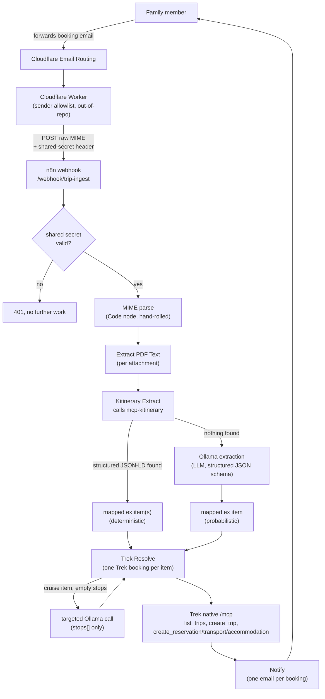

<!-- markdownlint-disable MD013 -->

# TripIt Replacement — Trip Ingestion Pipeline

**What this is**: a self-hosted replacement for TripIt-style trip aggregators. Forward any booking confirmation email to a dedicated address; it gets parsed, matched or created as a trip, and written into [Trek](https://github.com/liketrek/trek) (a self-hosted travel-planning app) — no third party ever sees your itinerary.

**Status**: live and in daily use. See the [features checklist](#features-checklist) for what's built vs. not.

**Audience for this doc**: someone implementing this pattern in their own cluster, or extending this one. It's a from-scratch architecture reference, not a build log — for the detailed decision-by-decision history (what was tried, what broke, exact live-test evidence), see git history on the docs this one replaces: `trip_ingestion_pipeline_tdd_sdd.md`, `kitinerary_mcp_server_spec.md`, `trip_ingest_kitinerary_integration_spec.md`.

---

## Why this exists

Commercial trip aggregators are convenient but come with real costs: your travel dates, confirmation numbers, traveler names, and payment details flow through a third party's ad-supported business model; core features sit behind a subscription; and there's no way to own or self-host your own data. This pipeline gets the same convenience — forward a confirmation email, watch a trip build itself — without any of that.

## Architecture



**Namespace map** (this cluster; adjust for your own):

| Component                            | Namespace       | Notes                                                                                                                |
| :----------------------------------- | :-------------- | :------------------------------------------------------------------------------------------------------------------- |
| Cloudflare Email Routing + Worker    | Cloudflare edge | Out-of-repo — lives in the Worker's own deploy pipeline                                                              |
| n8n (orchestration)                  | `household`     | Workflow content synced from git, see [Deployment](#deployment--how-to-change-it)                                    |
| `mcp-kitinerary` MCP server          | `ai`            | [Standalone repo](https://github.com/mrwulf/kitinerary-mcp), registered via [ToolHive](../cluster/apps/ai/toolhive/) |
| `ollama` (LLM fallback + enrichment) | `ai`            | Already deployed for other purposes                                                                                  |
| `trek` (trip store)                  | `household`     | Speaks MCP natively — no wrapper needed                                                                              |
| `smtp-relay` (outbound notification) | `system`        | Already deployed for other purposes                                                                                  |

## Components

### 1. Email ingestion — Cloudflare Worker

A Cloudflare Worker already bound to Email Routing traffic gets one extra rule: if the recipient matches the trip-ingest alias, stream the raw RFC-822 MIME (headers + body + attachments, unparsed) as the POST body to the n8n webhook, with `Content-Type: message/rfc822`. Two headers ride along: `X-Trip-Ingest-Secret` (the real auth gate — see below) and `X-Envelope-From` (n8n needs this to know who to notify and, for a new trip, who to add as a member).

The Worker also does a cheap sender-allowlist check before forwarding anything — not real auth (envelope `from` is trivially spoofable), just a deterrent against opportunistic scanner traffic. **The real gate is the shared secret**: the webhook route has zero auth at the ingress/proxy level (it has to stay open — it's shared infrastructure for every external trigger n8n handles), so the workflow's first node validates `X-Trip-Ingest-Secret` and returns a bare 401 with no further processing on mismatch. This is not optional — without it, the endpoint is an open door to both arbitrary compute consumption and arbitrary data injection.

**A real bug found live**: a genuine resend silently vanished — no n8n execution, no bounce visible to the sender. Cloudflare's `message.from` is the SMTP envelope sender, and webwulf.net's own mail relay rewrites it into a VERP bounce-tracking address (`bounce+<hash>-plans=sysinfra.pro@webwulf.net`) for some forwarding paths — which matches no sender-allowlist rule and is neither a deliverable inbox nor a Trek account, even though the message's own `From:` header still carried the real sender. The Worker (a separate repo, [`cloudflare-implementation`](https://github.com/mrwulf/cloudflare-implementation)) now also parses the raw message's own `From:` header as a second trust signal, and prefers it (when present) over the envelope for the `X-Envelope-From` value forwarded to n8n — that's the address n8n actually needs to be reachable.

### 2. n8n workflow — `cluster/apps/household/n8n/app/workflows/trip-ingest.json`

The whole pipeline is one n8n workflow. Node chain:

```text
Webhook → Code in JavaScript (secret check, MIME parse) → If (401 branch)
        → Respond Success (fires immediately — see below)
        → Extract PDF Text (per attachment) → Kitinerary Extract → Code in JavaScript1 (Ollama fallback + cruise enrichment)
        → Trek Resolve (one Trek booking per item) → Notify (one email per booking)
```

Two things worth calling out about this shape:

- **The HTTP response fires before the real work finishes.** `Respond Success` returns immediately after the secret check (the only fast-path check that exists); everything downstream (extraction, Trek writes, notification) continues asynchronously in the same execution via n8n's `responseMode: "responseNode"`. This exists because the full chain (LLM extraction + retries + Trek MCP round-trips + SMTP) can legitimately take minutes, and neither the sending mail server's SMTP timeout nor Cloudflare's Worker subrequest budget should have to survive that. Trade-off: only the secret check can still bounce the inbound SMTP transaction; everything past that relies entirely on the notification email as the signal, since the HTTP response is long gone by the time those run.
- **`Trek Resolve` runs once per mapped reservation, not once per email.** A single confirmation email can yield more than one bona fide booking (a non-connecting round-trip, a hotel + rental car in one itinerary PDF) — see [Multi-item support](#multi-item-support-multi-leg-flights-and-multiple-bookings-per-email) below.

### 3. Extraction: kitinerary first, Ollama as fallback and narrow enrichment

This is the part worth understanding in detail, since it's the least obvious design choice.

**Primary path — deterministic**: most real airline/hotel confirmation emails already embed `schema.org` `Reservation` JSON-LD markup (the same markup Gmail parses for its own "smart" trip cards). KDE's [`kitinerary-extractor`](https://invent.kde.org/pim/kitinerary) reads it out deterministically — no LLM, no hallucination risk — and also handles structured PDF tickets and Apple/Google Wallet `.pkpass` files the same way. It runs as its own small MCP server, [`kitinerary-mcp`](https://github.com/mrwulf/kitinerary-mcp) (a separate, standalone, publishable repo — see that repo's README for the server itself). `Kitinerary Extract` calls it with the raw email as a `.eml` file, maps every reservation it returns into the pipeline's flat `ex` shape (see [the mapping table](#json-ld--ex-mapping-table) below), and groups connecting flight legs into one booking.

**Fallback path — probabilistic**: when kitinerary finds nothing (no structured markup in the source, or an `@type` its mapping doesn't cover), the pipeline falls through unchanged to an Ollama call against a local LLM (`mistral:latest`, structured JSON-schema output) — the pipeline's original, only extraction method before kitinerary existed. Same `ex` shape, but the model's own document understanding does the work instead of a deterministic parser. Extraction quality here is inconsistent run to run (confirmed via repeated live tests) — accepted as a known trade-off, mitigated by the confirmation-email human-in-the-loop. Some real providers never populate the JSON-LD markup the primary path relies on at all — confirmed with Expedia's flight-purchase-confirmation template, which carries zero `schema.org` markup in either MIME part — so those always land on this path regardless of email quality.

**A real bug found live-testing this path**: the `Code in JavaScript` MIME-parsing node truncates the plain-text body to a fixed character budget (`bodyPreview: bodyText.slice(0, N)`) before it ever reaches Ollama. Some ESPs pad the start of the text/plain part with hundreds of bytes of zero-width-joiner/non-joiner HTML entities (`&zwnj;` and friends — an anti-preview-scraping technique, confirmed on a real Expedia confirmation), which ate most of that budget before any real content was reached, pushing a real field (the booking total) past the cutoff and out of the prompt entirely. `Code in JavaScript` now strips both the literal-entity and actual-unicode zero-width forms and collapses the whitespace they leave behind **before** truncating, and the budget itself was raised from 3000 to 6000 characters (the PDF-attachment budget below it was already far more generous per-attachment).

**A third, narrow path — targeted enrichment**: kitinerary cannot structurally extract multi-port cruise itineraries (`BoatReservation` carries no per-port stops in its data model at all). When a mapped item is a cruise with empty `stops`, the pipeline makes one supplementary Ollama call — reusing the same extraction prompt — and harvests **only** `.stops` from the result, keeping every other kitinerary-derived field (dates, confirmation code, amount) as the deterministic source of truth. **A blanket "always also ask the LLM" policy was considered and rejected** — it would reintroduce latency and hallucination risk on the ~90% of emails kitinerary already handles completely, for no benefit on those. Scoping the LLM call to the one case it's actually needed for is the whole point.

#### JSON-LD → `ex` mapping table

Reverse-engineered from Trek's own `kitinerary-mapper.js` (its built-in AI Booking Import feature runs the same CLI) — `r` is the raw reservation object, `r.reservationFor` is the nested thing being reserved (schema.org's own nesting convention).

Common to every type: `total_amount`/`currency` come from the same field-name ladder regardless of `@type` — check `r.price`, `r.priceAmount`, `r.totalPrice`, `r.total` (first non-null wins) on both the top-level object and `r.reservationFor`, since different providers nest it differently. `confirmation_code` is always `r.reservationNumber`.

| `@type`                                      | `booking_type` | `provider_name`                                                | dates live on...                                           | destination                                      |
| -------------------------------------------- | -------------- | -------------------------------------------------------------- | ---------------------------------------------------------- | ------------------------------------------------ |
| `FlightReservation`                          | `flight`       | `reservationFor.airline.name`/`.iataCode`                      | `reservationFor.departureTime`/`.arrivalTime`              | `reservationFor.arrivalAirport.name`/`.iataCode` |
| `TrainReservation`                           | `transit`      | `reservationFor.trainNumber`/`.trainName`                      | `reservationFor.departureTime`/`.arrivalTime`              | `reservationFor.arrivalStation.name`             |
| `BusReservation`                             | `transit`      | `reservationFor.busNumber`/`.busName`                          | `reservationFor.departureTime`/`.arrivalTime`              | `reservationFor.arrivalBusStop.name`             |
| `BoatReservation`                            | `cruise`       | `reservationFor.name`                                          | `reservationFor.departureTime`/`.arrivalTime`              | `reservationFor.arrivalBoatTerminal.name`        |
| `LodgingReservation`                         | `lodging`      | `reservationFor.name`                                          | **`r.checkinTime`/`.checkoutTime`** (not `reservationFor`) | `reservationFor.address` (formatted)             |
| `FoodEstablishmentReservation`               | `restaurant`   | `reservationFor.name`                                          | `r.startTime`/`.endTime`                                   | `reservationFor.address` (formatted)             |
| `RentalCarReservation`                       | `rental_car`   | `reservationFor.rentalCompany.name` + `.name`/`.make`/`.model` | **`r.pickupTime`/`.dropoffTime`** (not `reservationFor`)   | `r.dropoffLocation.name`/`.address`              |
| `EventReservation`, `TouristAttractionVisit` | `activity`     | `reservationFor.name`                                          | `reservationFor.startDate` or `r.startTime` (try both)     | `reservationFor.location.address`/`.name`        |
| anything else                                | —              | —                                                              | —                                                          | not handled — falls through to Ollama            |

**Two data-shape traps, found the hard way:**

1. **Some datetime fields come back wrapped**: `{"@type":"QDateTime","@value":"2031-09-10T08:00:00-05:00","timezone":"America/Chicago"}` rather than a plain ISO string. Confirmed live: `FlightReservation` departure/arrival times are always wrapped once an airport is timezone-resolved; `LodgingReservation` check-in/out times came back as plain strings for an otherwise-equivalent source. Unwrap defensively (check for a string first, fall back to `.@value`) on every date field, not just the ones observed broken — an unwrapped object silently produces `NaN` out of `new Date(...)` rather than throwing at the point of the actual bug.
2. **kitinerary's own result validation rejects an under-specified reservation outright** — `items: []`, not a partial extraction. A synthetic `BoatReservation` with only a name and times (no terminal objects) produced nothing at all; adding proper `BoatTerminal` objects with address data made it extract correctly. Worth knowing before assuming kitinerary "should have" found something from a minimal source.

#### Multi-item support: multi-leg flights and multiple bookings per email

A single email can describe more than one real booking, and the pipeline handles two distinct cases:

- **Connecting flight legs** (same confirmation number, arrival airport of leg N == departure airport of leg N+1, gap under 24h and forward in time) are grouped into **one** flight booking, with the intermediate airports carried in `stops[]` — matching Trek's own mapper, and avoiding N separate disconnected-looking bookings for what's really one itinerary.
- **Genuinely separate reservations** in the same email (a non-connecting outbound + return, a hotel + rental car in one itinerary PDF) each become their own mapped item, fanned out into separate n8n items, each producing its own Trek booking and its own confirmation email.

**A real bug found building this**: multi-passenger bookings commonly emit one near-identical `FlightReservation` per passenger per leg, all sharing the same confirmation number. Grouped naively (sort by time, chain consecutive legs), this can merge leg N of one passenger's itinerary onto leg N+1 of a **different** passenger's, purely because the times line up — Trek's schema has no per-leg passenger tracking, so legs are still deduped (same route + times) down to one representative before grouping. Passenger **identity** is no longer lost in that collapse, though — see [Passenger capture and trip ownership](#passenger-capture-and-trip-ownership) below.

`Trek Resolve` runs in n8n's `mode: runOnceForEachItem` to process each mapped item independently. Two n8n-specific traps surfaced getting this right, both confirmed live before touching the production workflow:

- `$input.first()`/`$input.all()` are disallowed entirely in that mode (`Can't use .first() here`) — use `$json` for the current item, or `$('OtherNode').first()` for a cross-node reference (still valid). The final `return` must be a bare `{ json: {...} }`, not `[{ json: {...} }]` — the array form throws `A 'json' property isn't an object`.
- n8n's each-item-mode validator does a **naive text scan** for disallowed method names, not AST analysis — a code **comment** that literally contains the text `.first()` gets the node rejected, with no actual call anywhere in the code.

#### Passenger capture and trip ownership

Two related gaps found live-testing a real forwarded confirmation: passenger names never reached Trek at all, and every trip lands in whichever Trek account owns `TREK_API_TOKEN` — not the person who actually forwarded the email.

**Passenger capture.** schema.org `Reservation.underName` (a `Person`, occasionally an array) carries the traveler's name and survives extraction — confirmed live with a synthetic 2-passenger fixture run straight through `kitinerary-extractor`. `Kitinerary Extract` now reads it on every mapped type, folding it into `passenger_names: string[]` on the `ex` shape (the Ollama fallback schema carries the same field, extracted from any names the email states explicitly — never invented). The one wrinkle: `dedupeIdenticalLegs` (see above) still collapses a multi-passenger booking's identical legs down to one representative **before** names would otherwise be lost with them — each dropped leg's `underName` is folded onto the survivor's `_passengerNames` first, so `mapFlightGroup` still reports every traveler even though only one leg object survives grouping.

**Attaching passengers to the Trek booking.** `Trek Resolve` resolves each `passenger_names` entry against the trip's roster (`get_trip_summary`'s `members`, which includes guests) by name match (exact, or first-word-only — a Trek account's own username is typically just a first name, e.g. `Chelsea`, while a booking's `underName` usually carries a full one, e.g. `Chelsea Gordon`); an unmatched name becomes a new `create_trip_guest` (Trek's account-less companion record — see its `Trip-Members-and-Sharing` wiki page). The resolved ids are attached via `set_reservation_travelers` on the created booking, for anything backed by Trek's `reservations` table (`create_transport`, and both `create_reservation` paths). `create_accommodation` has no equivalent tool (an accommodation isn't a `reservations` row), so lodging instead gets the names appended into its `notes` field.

**A real bug found live: family members with real Trek accounts still got added as guests.** Roster-only name matching only catches someone already on _this_ trip — for a brand-new trip, kitinerary/Ollama only ever supply a passenger's plain name, never an email or Trek username, so there's no way to look up an existing global account from that alone (Trek's MCP has no user-search tool; `add_trip_member` needs an exact username or email up front). `Trek Resolve` now also checks a small first-name → Trek-account-email map (`TRIP_INGEST_FAMILY_MEMBERS_JSON`) before falling back to a guest, calling `add_trip_member` for a hit. **This map lives in Bitwarden** (`Trip Ingest Pipeline Credentials` → `FAMILY_MEMBERS_JSON`, a JSON object like `{"chelsea": "chelsea@webwulf.net"}`), never in this repo — household member emails are PII and this repo is public. A name with no entry in the map (or one whose mapped account no longer exists) falls through to `create_trip_guest` exactly as before.

**Trip ownership.** When a booking creates a brand-new trip, the pipeline makes a best-effort `add_trip_member(identifier: envelopeFrom)` call so the actual sender becomes a real collaborator on their own trip instead of it existing only under the token's account. This is expected to no-op/fail for a sender with no Trek account (or a non-household forward) — caught and folded into the notification as a warning, never allowed to block booking creation. It does not change who **owns** the trip (Trek's owner is fixed to whoever created it — see [Trip transfer](https://github.com/liketrek/TREK/wiki/Trip-Members-and-Sharing#transferring-ownership) if that's ever wanted instead), only who else can see and edit it.

Both resolution failures (a guest that couldn't be created, an unreachable `add_trip_member`) surface as a `Warning:` line in the notification email — degraded, never silent.

#### Flight route detail: endpoints, legs, and metadata

Found live against a real 1-layover booking: the Trek record showed the correct overall departure/arrival time but no airports, no layover, and no flight numbers at all.

**Root cause.** `Trek Resolve`'s `endpoints[]` builder only ran when `stops.length > 1` — but `stops[]` carries **intermediate** connections only (origin/destination live in separate `ex.origin_*`/`destination_*` fields), so a direct flight (0 stops) or the overwhelmingly common single-layover flight (1 stop) never triggered it at all. `endpoints[]` now builds whenever a full route exists (`origin` + `destination` present), regardless of stop count — origin, every intermediate stop, and destination each become one endpoint.

**Flight numbers were never captured at all** — `mapFlightGroup` read `airline` off each leg's `reservationFor` but never `flightNumber`. `Kitinerary Extract` now collects it per leg (`flight_number: "6550 / 3245"` for a 2-leg itinerary) onto the `ex` shape, and `Trek Resolve` writes it into the booking's `metadata` (`{ airline, flight_number, departure_airport, arrival_airport }` — the shape `create_transport`'s own docstring specifies for flights) alongside the endpoints.

**Airport coordinates: code over geocoding.** For a flight endpoint, `Trek Resolve` now sets `code: <IATA>` instead of free-text geocoding through `search_place` — Trek resolves the airport's coordinates from the code server-side, which is both more reliable and skips a network round-trip. Non-flight transport (train, cruise) still geocodes by name, since there's no equivalent universal code system for those.

**Per-connection times need `legs[]`, not just `endpoints[]`.** A shared connecting airport (the layover) is a single `endpoints[]` row with one `local_time` field — it cannot hold both "arrived 4:45pm" and "departed 6:00pm" at once. Trek's `legs[]` input (`from`/`to`/`airline`/`flight_number`/`dep_time`/`arr_time` per segment, one entry per real flight, one fewer than `endpoints[]`) is the only way to record both. `Kitinerary Extract` now builds `leg_details[]` (empty for a direct flight, where there's no shared stop to disambiguate) and `Trek Resolve` passes it straight through as `args.legs`.

**Legs also need their own day ids, not just times.** Trek's client derives each leg's day-plan placement from `legs[].dep_day_id`/`arr_day_id`, falling back to the booking's single overall `day_id` when a leg omits them — so an unset leg-level day silently pins every leg of a multi-day-spanning booking onto just the first one, and it isn't tied to its own day in the planning view at all. `leg_details[]` now carries a `dep_date`/`arr_date` per leg, and `Trek Resolve` resolves each through `ensureDayId` (creating the day row on demand, same as it already does for the booking's own start/end) before writing `legs[]`. That date has to be computed the exact same way the booking's own start/end day already is (`new Date(iso).toISOString().slice(0, 10)`, i.e. UTC) — Trek validates that a leg's day agrees with the booking's overall one and rejects the write otherwise (confirmed live: `end_day_id does not match legs[1].arr_day_id`). This also means a late-night arrival in a negative UTC offset can land a day later than a human reading the local time would expect — a pre-existing quirk of how every day in this pipeline is computed, not something introduced here, and out of scope for this fix beyond keeping leg-level and booking-level days consistent with each other.

**Legs also need their own confirmation number.** Trek's own tool docs say an unset leg `confirmation_number` falls back to the booking's own — found live that this isn't visibly happening wherever it's meant to be read back. `Trek Resolve` now sets it explicitly on every leg (`ex.confirmation_code`) rather than depend on that inheritance, since kitinerary/Ollama don't currently distinguish a per-segment reference from the booking's own anyway.

Confirmed live end-to-end (disposable workflow, synthetic 2-leg fixture): the resulting Trek booking carried correct `metadata.legs[]` times, day ids, and confirmation numbers, IATA-resolved endpoint coordinates, and the full ACY→PHL→SAN route with layover — with no manual follow-up. A live production booking created before this fix existed needed its `day_id`/`end_day_id` restored by hand afterward, having been accidentally cleared by an earlier manual correction that set `legs[]` without also re-stating the day ids — the same trap `ensureDayId` now closes for the pipeline's own writes.

### 4. Trip resolution — Trek's native MCP endpoint

Trek ships its own `/mcp` endpoint natively (bearer-token auth, independent of its human-login OIDC mode) — call it directly over cluster-internal DNS. **Do not wrap an already-MCP-native app behind a gateway like ToolHive**; that's a redundant hop and a second thing to keep in sync for no capability gained.

Resolution algorithm, run once per mapped booking item:

1. `list_trips`, then match against existing trips within a ±3 day window of the booking's start date. No match → `create_trip`.
2. If the booking's dates fall outside the matched trip's current `start_date`/`end_date`, extend it via `update_trip` first (a trip should grow to fit its bookings, not the other way around).
3. Dedup: exact match on `confirmation_code` first; if that doesn't match, a same-type + overlapping-date-window fallback (flight/transit/cruise/lodging only — other types don't have a reliable duplicate signal) that also requires the provider names to share a word before it's allowed to fire. That second requirement exists because bare type+date overlap alone matched a genuine new booking against a completely unrelated existing record in production once real household data hit it — see git history for the exact incident.
4. Not a duplicate → `create_transport` (flight/transit) or the accommodation/place-resolution flow (`search_place → create_place → create_accommodation`, falling back to a bare `create_reservation` if no place match) for lodging, or `create_reservation` for everything else. Also links the booking to the trip's day-by-day itinerary (`assign_place_to_day` for accommodations) and files a linked cost entry when the currency matches the trip's own.
5. Every booking this pipeline creates is marked Trek status `confirmed`, never left as Trek's default `pending` recommendation — the forwarded email itself is the confirmation of the reservation or activity. `create_transport` takes `status` directly at creation; `create_reservation` has no such field, so it's created pending and immediately confirmed via a follow-up `update_reservation` call. `create_accommodation` needs no extra step — Trek always auto-confirms the hotel reservation it creates alongside the stay.

Trek's MCP has no server-side "search reservations by confirmation code" tool — dedup is done by pulling the full `get_trip_summary` and scanning client-side.

### 5. Notification

One email per created/duplicate/failed booking (n8n's default per-item behavior for a non-Code node downstream of a per-item execution) via the cluster's existing outbound relay — no new SMTP credential. Every notification ends with a `Ref: n8n-exec-<id>` correlation ID, a direct key into n8n's own execution history for diagnosis. A failure anywhere in the chain (extraction, Trek write) still produces a notification — the pipeline never fails silently.

## Deployment — how to change it

**Editing a Code node's JavaScript.** `trip-ingest.json` is the literal export n8n's Public API expects — every Code node's script sits inline as one long JSON string, which makes it unreadable and gives every edit a one-line, whole-blob git diff. The reviewable source lives instead in `workflows/trip-ingest/`: `workflow.json` (the same export with each Code node's `jsCode` blanked out) plus one formatted `<node name>.js` file per Code node (`Trek Resolve.js`, `Kitinerary Extract.js`, etc.). To change a node's logic: edit its `.js` file, then run `task n8n:build` to fold it back into `trip-ingest.json` (which also runs `prettier --write` on the result) and commit both. `task n8n:extract` does the reverse — bootstrap or re-adopt after an edit made directly in the n8n UI and re-exported. `task test:all` (via `task n8n:check`) fails the build if `trip-ingest.json` and the `.js` files ever drift apart, so the two can't silently diverge. The sync script is `scripts/n8n-workflow-sync.mjs`; both directions only move text, they never reformat it — that's prettier's job, which is why every edit still needs a `task n8n:build` before it will pass lint.

There's no file-mount or CLI-import path into a running n8n instance; the live workflow lives in n8n's own DB. The chain from a git commit to a live change:

```text
git commit → git push → Flux GitRepository reconcile → Flux Kustomization reconcile
  → ConfigMap (n8n-trip-ingest-workflow) updated → CronJob PUTs it into n8n's own DB via its Public API
  → only then does a live webhook execution reflect the change
```

Every arrow can lag independently, and the sync CronJob runs on its own 15-minute schedule regardless of who last touched the workflow — **editing live via the UI or API without updating the git file first gets silently reverted on the next tick.** Git is genuinely the source of truth; treat the CronJob as adversarial to any uncommitted live edit. When timing matters (active testing), trigger both Flux reconciles explicitly and a one-off `kubectl create job --from=cronjob/n8n-workflow-sync`, and confirm the node list matches via n8n's own API before testing against it.

**Testing methodology**: there's no staging n8n or staging Trek — testing means testing against the real instance. The pattern used throughout this pipeline's development: build a synthetic fixture with a distinctive marker (`ZZTEST`) and dates far in the future, `kubectl exec` into the n8n pod and drive everything through `node -e '...fetch...'` (no `curl` in the image), and for anything riskier than a read — a change to node execution mode, a new branch in the logic — first push it to a **disposable duplicate n8n workflow** (same content, a different webhook path, created via the Public API, deleted after) rather than the live one. This avoids both the 15-minute sync-CronJob clobbering problem and any chance of leaving broken state in production mid-test. Every test trip gets deleted via Trek's own `delete_trip` MCP tool and confirmed gone via a follow-up DB read before moving on.

## Known limitations

- **No dead-letter/reprocess mechanism.** A failed email's only recovery today is manually finding the `.eml` and resubmitting by hand.
- **The n8n editor UI's WebSocket is broken on this cluster** (`[WebSocketClient] Connection lost, code=1006`) — the backend executes nodes fine, but "Execute step" never shows a result in the UI. Suspected cause: the forward-auth middleware chain doesn't cleanly pass the WebSocket upgrade through. Worked around entirely by testing through the Public API and live webhook calls instead of the UI's manual node executor.
- **The SMTP notification credential isn't GitOps-tracked** — created once via n8n's own API, referenced by ID in the workflow JSON. If n8n's DB is ever rebuilt, this needs recreating by hand.
- **Concurrent duplicate-trip creation is an accepted risk, not solved.** Two near-simultaneous forwards for the same not-yet-existing trip can race past the matching check before either has created one. At household scale (a handful of forwards per trip, from a handful of people), this is judged not worth distributed locking for — the failure mode is cheap to fix by hand.
- **Ollama extraction quality varies run to run** on the fallback path — inherent to LLM-based extraction, mitigated (not eliminated) by the always-on confirmation email giving a human a chance to catch a bad extraction.
- **kitinerary depends entirely on the provider embedding schema.org markup.** Some real providers don't (confirmed: Expedia's flight-purchase-confirmation template) — those emails always land on the Ollama fallback path, regardless of email quality.
- **No traveler field on accommodations.** Trek's `set_reservation_travelers` only attaches to `reservations`-table bookings (flights, transit, cruises, and the generic/hotel-fallback `create_reservation` path) — a place-linked `create_accommodation` booking gets passenger names folded into its `notes` field instead, since Trek has no equivalent tool for it.
- **`add_trip_member(envelopeFrom)` only works for a sender with an existing Trek account.** A forward from someone with no account (or a non-household address) fails harmlessly and surfaces as a notification warning — there's no invite-and-add flow.
- **Per-leg flight detail (`legs[]`, IATA-code endpoints) only exists on the deterministic kitinerary path.** The Ollama fallback schema has a `flight_number` field, but building accurate per-segment `dep_time`/`arr_time` from an LLM's free-text understanding was judged not worth the added hallucination surface — a fallback-path flight still gets its overall route (`origin`/`destination`/`stops`) and metadata, just not disambiguated per-leg layover times.
- **Ollama's choice of confirmation code is a prompt instruction, not a guarantee.** When a source states more than one reference number (an airline confirmation plus an OTA/travel-agency itinerary number, e.g. Expedia's own itinerary number alongside the airline's), the prompt says to prefer the provider's own code — but, being an LLM, it can still pick wrong or omit one on a given run.

## Features checklist

- [x] Email ingestion via existing Cloudflare Worker, shared-secret auth gate
- [x] Raw MIME parsing (multipart, quoted-printable/base64, nested `message/rfc822` forwards), HTML/plain-text body extraction
- [x] PDF attachment text extraction (all attachments, not just the first)
- [x] Deterministic extraction via kitinerary — lodging, flight, train, bus, cruise, restaurant, rental car, activity
- [x] Multi-leg flight grouping (connecting legs → one booking)
- [x] Multi-passenger booking dedup (identical legs collapsed before grouping, passenger identity preserved across the collapse)
- [x] Passenger capture (`underName`) attached to the Trek booking via `set_reservation_travelers`, creating trip guests as needed
- [x] Best-effort trip-membership for the actual sender (`add_trip_member(envelopeFrom)`), not just whoever owns the API token, preferring the message's own `From:` header over a relay-rewritten envelope sender
- [x] Known family members with real Trek accounts added as real members (via a Bitwarden-backed name→email map), not guests, when a passenger name matches
- [x] Flight route detail: endpoints built for any full route (not just 2+ stops), IATA-code airport resolution, flight numbers, and per-leg layover times via `legs[]`
- [x] Multiple genuinely-separate bookings per email (fan-out, one Trek booking each)
- [x] Zero-width-junk stripping and a larger body-preview budget so real content isn't truncated away before extraction
- [x] LLM fallback extraction (Ollama) when kitinerary finds nothing
- [x] Scoped LLM enrichment for cruise multi-port stops (kitinerary's one structural gap)
- [x] Trip matching/creation via Trek's native MCP, ±3 day window
- [x] Trip auto-expansion when a booking falls outside the matched trip's date range
- [x] Duplicate detection: exact confirmation match, plus a provider-name-correlated date-overlap fallback
- [x] Accommodation day-linkage (`assign_place_to_day`) and linked cost tracking
- [x] Retry-with-backoff on both Ollama and Trek MCP calls
- [x] Always-on notification (success, duplicate, and failure all produce an email) with a correlation ID
- [x] Fast synchronous webhook response, async continuation for the real work
- [x] Declarative workflow in git, synced into the running n8n instance via a CronJob
- [ ] Dead-letter/reprocess mechanism for failed emails
- [ ] n8n editor UI WebSocket fix (workaround in place, root cause not fixed)
- [ ] SMTP credential brought under GitOps tracking
- [ ] Distributed locking for concurrent duplicate-trip creation (accepted risk, not planned)

## Related

- [`kitinerary-mcp`](https://github.com/mrwulf/kitinerary-mcp) — the standalone MCP server this pipeline's deterministic extraction path runs on
- [ToolHive README](../cluster/apps/ai/toolhive/README.md) — how `mcp-kitinerary` (and every other MCP server in this cluster) is registered and reached
- `cluster/apps/household/n8n/app/workflows/trip-ingest.json` — the actual workflow, source of truth
